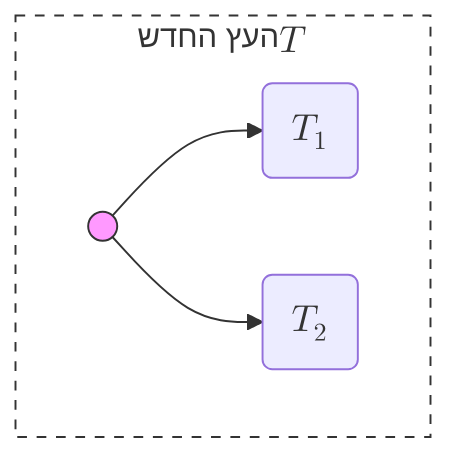
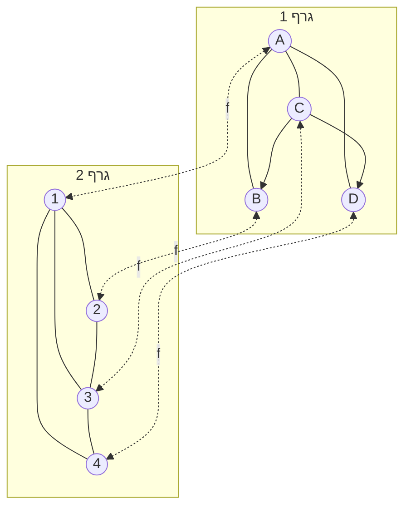
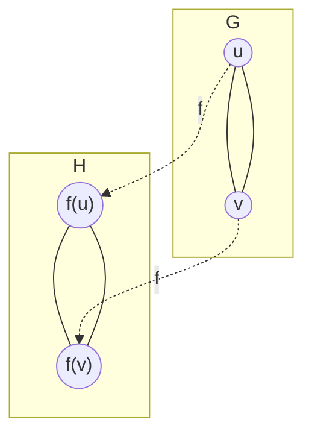
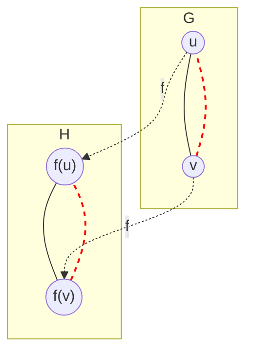

# אינדוקציה מבנית

## הרצאה בקורס: מבוא ללוגיקה ותורת הקבוצות

 מרצה: פרופ. גרא וייס

---
section: אינדוקציה מבנית
---

# אינדוקציה רגילה / אינדוקציה מבנית

## אינדוקציה מבנית: מגדל לגו 🧱

**העיקרון:** היררכיה (חלקים $\to$ שלם).  לא "מה המספר הבא?", אלא **"איך זה נבנה?"**.

1.  **בסיס (Basic Blocks):** אבני הבניין הפשוטות ביותר מקיימות את התכונה.

2.  **צעד הבנייה (Construction Step):** חיבור חלקים תקינים יוצר שלם המקיים את התכונה.

  

## אינדוקציה רגילה: אפקט הדומינו 🁕

**העיקרון:** ליניאריות (סדר קבוע $n \to n+1$).

1.  **בסיס:** האבן הראשונה נופלת.

2.  **צעד:** אם אבן $n$ נופלת $\implies$ אבן $n+1$ נופלת.
3.  **תוצאה:** הכל נופל לפי הסדר (1, 2, 3...).

  

---

# דוגמה: הגדרה רקורסיבית של $\mathrm{Fin}(\mathbb{N})$
 

$\mathrm{Fin}(\mathbb N)$ היא הקבוצה של כל תתי־הקבוצות הסופיות של $\mathbb N$.
נגדיר אותה כבנייה אינדוקטיבית (מבנית):

## שלב בסיס

$$
\emptyset \in \mathrm{Fin}(\mathbb N)
$$

## צעד בנייה
לכל $A \in \mathrm{Fin}(\mathbb N)$ ולכל $n\in\mathbb N$:
$$
A \cup \{n\} \in \mathrm{Fin}(\mathbb N)
$$

## אינטואיציה
מתחילים מ־$\emptyset$  
ומוסיפים איברים אחד־אחד - מספר סופי של פעמים.

---

# אינדוקציה מבנית על $\mathrm{Fin}(\mathbb N)$

כדי להוכיח תכונה $P(A)$ לכל $A\in\mathrm{Fin}(\mathbb N)$ מספיק:

- להוכיח $P(\emptyset)$
- להראות:
$
P(A)\Rightarrow P(A\cup\{n\})
$
לכל $A\in\mathrm{Fin}(\mathbb N)$ ולכל $n\in\mathbb N$.

  

 

---

# דוגמה: כוחה של אינדוקציה מבנית

**טענה:** לכל $A \in \mathrm{Fin}(\mathbb N)$, הקבוצה $A$ היא סופית (קיימת התאמה חח"ע ועל ל-$\mathbb{N}^{<k}$ עבור $k$ כלשהו).

1.  **בסיס ($\emptyset$):**
    - נבחר $k=0$. מתקיים $\emptyset = \mathbb{N}^{<0}$.
    - פונקציית הזהות (הריקה) היא חח"ע ועל מ-$\emptyset$ ל-$\mathbb{N}^{<0}$.

2.  **צעד ($A \cup \{n\}$):**
    - נניח ש-$A$ סופית, כלומר קיימת $f \colon A \to \mathbb{N}^{<k}$ חח"ע ועל.
    - **מקרה א ($n \in A$):** $A \cup \{n\} = A$, ולכן היא סופית (עם אותה $f$ ו-$k$).
    - **מקרה ב ($n \notin A$):** נגדיר $g \colon A \cup \{n\} \to \mathbb{N}^{<k+1}$:
      $$ g(x) = \begin{cases} f(x) & x \in A \\ k & x = n \end{cases} $$
    - קל לראות ש-$g$ חח"ע ועל, ולכן $A \cup \{n\}$ סופית (בגודל $k+1$).

---
layout: TwoColsHeaderCustom
---

# כיוון שני: כל תת-קבוצה סופית היא ב-$\mathrm{Fin}(\mathbb N)$

**טענה:** תהא $A \subseteq \mathbb{N}$. אם $A$ סופית, אז $A \in \mathrm{Fin}(\mathbb{N})$.

**הוכחה:** באינדוקציה (רגילה) על גודל הקבוצה $|A|$.

::left::

**בסיס האינדוקציה:**
- אם $|A|=0$, אז $A = \emptyset$.

- לפי הגדרת הבסיס של $\mathrm{Fin}(\mathbb{N})$, מתקיים $\emptyset \in \mathrm{Fin}(\mathbb{N})$.

::right::

**צעד האינדוקציה:**

- נניח שהטענה נכונה לכל קבוצה בגודל $k$.
- תהא $A$ קבוצה בגודל $k+1$.
- נבחר איבר כלשהו $n \in A$.
- נגדיר $A' = A \setminus \{n\}$. מתקיים $|A'| = k$.
- לפי הנחת האינדוקציה, $A' \in \mathrm{Fin}(\mathbb{N})$.
- לפי כלל הבנייה, $(A' \cup \{n\}) \in \mathrm{Fin}(\mathbb{N})$.

- אבל $A' \cup \{n\} = (A \setminus \{n\}) \cup \{n\} = A$, ולכן $A \in \mathrm{Fin}(\mathbb{N})$.

---

# עקרון האינדוקציה המבנית

**נתון:** קבוצה $S$ המוגדרת ע"י בסיס $B$ ופעולות בנייה $K$.

**כדי להוכיח $\forall x \in S, P(x)$:**

1.  **בסיס:** הוכח $P(b)$ לכל $b \in B$.

2.  **צעד:** לכל $k \in K$, הוכח שהתכונה נשמרת:
    $$
    P(x_1) \land \dots \land P(x_m) \implies P(k(x_1, \dots, x_m))
    $$

**מסקנה:** התכונה מתקיימת לכל איברי הקבוצה.

  

---

# שימוש באינדוקציה במדעי המחשב

במדעי המחשב אנו עוסקים רבות במבנים המוגדרים באופן רקורסיבי:
- **רשימות** (Lists)

- **עצים** (Trees)
- **נוסחאות** לוגיות (Formulas)
- **דקדוקים** (Grammars)

**אינדוקציה מבנית** היא הכלי המרכזי להוכחת תכונות על מבנים אלו.

  

---
section: עצים
---

# דוגמה: עץ בינארי מלא 🌲

**הגדרה:** נגדיר את קבוצת העצים הבינאריים המלאים $\mathcal{T}$ באופן אינדוקטיבי:

1.  **בסיס:** צומת בודד $\bullet$ הוא עץ ב-$\mathcal{T}$.
2.  **צעד:** אם $T_1, T_2 \in \mathcal{T}$ הם עצים בינאריים מלאים, אזי העץ $T = \text{Tree}(\bullet, T_1, T_2)$ (המורכב משורש $\bullet$ ושני תתי-עצים $T_1, T_2$) הוא עץ ב-$\mathcal{T}$.

**דוגמא:** $\text{Tree}(\bullet, \text{Tree}(\bullet, \bullet, \bullet), \bullet)$

```mermaid {scale: 0.5}
graph TD
    classDef dot fill:#000,stroke:#000,stroke-width:2px;
    R(( )):::dot
    L(( )):::dot
    RightLeaf(( )):::dot
    LL(( )):::dot
    LR(( )):::dot
    
    R --- L
    R --- RightLeaf
    L --- LL
    L --- LR
    
    linkStyle default stroke-width:2px;
```

**הגדרת פונקציות עזר:**

עבור עץ $T \in \mathcal{T}$:
*   $N(T)$ - מספר הצמתים (Nodes).

*   $L(T)$ - מספר העלים (Leaves).
*   $I(T)$ - מספר הצמתים הפנימיים ($N(T) - L(T)$).

**הגדרות רקורסיביות:**

*   **עבור עלה (בסיס):**
    *   $N(\bullet) = 1, L(\bullet) = 1, I(\bullet) = 0$.

*   **עבור עץ מורכב $T = \text{Tree}(\bullet, T_1, T_2)$:**
    *   $N(T) = 1 + N(T_1) + N(T_2)$
    *   $L(T) = L(T_1) + L(T_2)$
    *   $I(T) = 1 + I(T_1) + I(T_2)$

---
layout: TwoColsHeaderCustom
---

# הוכחה באינדוקציה מבנית: מספר העלים מול הפנימיים

**טענה:** לכל עץ בינארי מלא $T \in \mathcal{T}$ מתקיים: **$L(T) = I(T) + 1$**.

**הוכחה באינדוקציה מבנית:**

::left::

<v-click>

**בסיס:** עבור עלה בודד $T = \bullet$:
*   $L(\bullet) = 1$.

*   $I(\bullet) = 0$.
*   מתקיים: $1 = 0 + 1$. ✓
</v-click>

::right::

<v-click>

**צעד:** נניח נכונות עבור $T_1, T_2$. נוכיח עבור $T$ המחובר משניהם.
*   $L(T) = L(T_1) + L(T_2)$ (מהגדרת העלים).

*   לפי הנחה: $L(T_1) = I(T_1) + 1$ ו-$L(T_2) = I(T_2) + 1$.
*   נציב: $L(T) = (I(T_1) + 1) + (I(T_2) + 1)$.
*   נסדר מחדש: $L(T) = (1 + I(T_1) + I(T_2)) + 1$.
*   נזהה את הביטוי בסוגריים כ-$I(T)$:
*   **$L(T) = I(T) + 1$**. ✓

</v-click>

---

# למה דווקא אינדוקציה מבנית? 💡

### אינטואיציה לצעד
אנחנו לוקחים שני עצים "תקינים" (שמקיימים את הנוסחה) ומחברים אותם עם בורג אחד (השורש).

*   העלים של העץ החדש הם סכום העלים של הקודמים.

*   הצמתים הפנימיים הם סכום הקודמים **פלוס השורש החדש**.

זה בדיוק ה- $+1$ בנוסחה שנשמר!

  

### השוואה לאינדוקציה רגילה

*   **אינדוקציה על גובה ($h$):**
    *   נניח נכון לעצים בגובה $< h$.
    
    *   עץ בגובה $h$ מורכב מתתי-עצים בגבהים שונים (לא בהכרח $h-1$). הניסוח מסורבל יותר.

*   **אינדוקציה על מספר צמתים ($n$):**
    *   צריך להראות שכל עץ עם $n$ צמתים נבנה מעצים קטנים יותר.

    *   האינדוקציה המבנית "תופרת" את ההוכחה בדיוק לפי צורת הבנייה של האובייקט.

---
section: תחשיב פסוקים
---

# דוגמה: תחביר תחשיב הפסוקים (Propositional Logic)

**הגדרה:** תהי $Atoms$ קבוצה של פסוקים אטומים (למשל $\{P, Q, R, \dots\}$).
נגדיר את קבוצת הפסוקים $\mathrm{PROP}(Atoms)$ באופן אינדוקטיבי:

1.  **אטומים:** לכל $p \in Atoms$, מתקיים $p \in \mathrm{PROP}(Atoms)$.
2.  **שלילה:** אם $\phi \in \mathrm{PROP}(Atoms)$, אזי $\neg \phi \in \mathrm{PROP}(Atoms)$.
3.  **קשרים בינאריים:** אם $\phi, \psi \in \mathrm{PROP}(Atoms)$, אזי:
    - $(\phi \land \psi) \in \mathrm{PROP}(Atoms)$
    - $(\phi \lor \psi) \in \mathrm{PROP}(Atoms)$
    - $(\phi \to \psi) \in \mathrm{PROP}(Atoms)$

**הערה:** אנו מקפידים על סוגריים מסביב לכל פעולה בינארית כדי למנוע דו-משמעות.

**דוגמאות:**
- $P$ - פסוק אטומי.
- $(\neg P)$ - פסוק.
- $((P \land Q) \to (\neg R))$ - פסוק תקין.
- $P \land Q$ - אינו פסוק לפי ההגדרה הפורמלית (חסרים סוגריים).

  

---
layout: two-cols-header
---

# הוכחה באינדוקציה מבנית: איזון סוגריים

**טענה:** בכל פסוק $\phi \in \mathrm{PROP}(Atoms)$, מספר הסוגריים הימניים שווה למספר הסוגריים השמאליים.

::left::

**הוכחה:**
נגדיר תכונה $T(\phi)$: $L(\phi) = R(\phi)$.

1.  **בסיס:** עבור אטום $p \in Atoms$:
    - $L(p) = 0, R(p) = 0$.
    - $0=0$ ✓

2.  **צעד (שלילה):** נניח $T(\phi)$. נבדוק עבור $\neg \phi$:
    - $L(\neg \phi) = L(\phi)$.
    - $R(\neg \phi) = R(\phi)$.
    - מההנחה $L(\phi)=R(\phi)$, ולכן השוויון נשמר. ✓

::right::

3.  **צעד (בינארי):** נניח $T(\phi)$ ו-$T(\psi)$. נבדוק עבור $(\phi \circ \psi)$ כאשר $\circ \in \{\land, \lor, \to\}$:
    - $L((\phi \circ \psi)) = 1 + L(\phi) + L(\psi)$.
    - $R((\phi \circ \psi)) = R(\phi) + R(\psi) + 1$.
    - מההנחות $L(\phi)=R(\phi)$ ו-$L(\psi)=R(\psi)$.
    - סה"כ: הצדדים שווים ✓

**מסקנה:** התכונה מתקיימת לכל פסוק ב-$\mathrm{PROP}(Atoms)$.

  

---

# משמעות של ביטוי (סמנטיקה)

**הגדרה:** המשמעות של ביטוי בתחשיב הפסוקים היא ערך אמת (True/False).

1.  **השמה (Valuation):** פונקציה $v \colon Atoms \to \{T, F\}$ המתאימה ערך אמת לכל אטום.

2.  **הרחבה לפסוקים מורכבים ($\hat{v}$):**
    נגדיר פונקציה $\hat{v} \colon \mathrm{PROP}(Atoms) \to \{T, F\}$ באופן אינדוקטיבי:
    *   **אטום:** לכל $p \in Atoms$, $\hat{v}(p) = v(p)$.
    
    *   **שלילה:** $\hat{v}(\neg \phi) = T$ אמ"מ $\hat{v}(\phi) = F$.
    *   **קשרים בינאריים:**
        *   $\hat{v}(\phi \land \psi) = T$ אמ"מ $\hat{v}(\phi)=T$ וגם $\hat{v}(\psi)=T$.
     
        *   $\hat{v}(\phi \lor \psi) = T$ אמ"מ $\hat{v}(\phi)=T$ או $\hat{v}(\psi)=T$.
        *   $\hat{v}(\phi \to \psi) = T$ אמ"מ לא ($\hat{v}(\phi)=T$ וגם $\hat{v}(\psi)=F$).

---
section: לוגיקה מסדר ראשון (פשוט)
---

# לוגיקה מסדר ראשון (FOL)

**לוגיקה מסדר ראשון (FOL)** היא שפה פורמלית המאפשרת לתאר את העולם בצורה מדויקת ועשירה יותר מלוגיקת פסוקים.

 

❌ <b>לוגיקת פסוקים:</b>
רואה משפטים כ"קופסאות שחורות" ($p, q$).

 

✅ <b>לוגיקה מסדר ראשון:</b>
"מסתכלת פנימה" ומאפשרת לדבר על <u>אובייקטים</u>, <u>תכונות</u> ו<u>יחסים</u>.

 

- **נגדיר:**

  1.  **תחביר (Syntax)** 🧩 (משתנים, קבועים, כמתים $\forall, \exists$)

  2.  **סמנטיקה ומודלים** 🌍 (מתי נוסחה היא "אמת" ומתי "שקר"?)

---

# אבני הבניין: שמות (Terms)

לפני שנבנה משפטים, נבין את המרכיבים הבסיסיים שמצביעים על אובייקטים.

### 1. קבועים (Constants)
מציינים **אובייקט ספציפי** בעולם.
* השם "שרה" $\rightarrow$ מייצג אדם ספציפי.

* המספר "0" $\rightarrow$ מייצג מספר ספציפי.
* סימון מתמטי: $a, b, c$ או $\operatorname{Sarah}$.

### 2. משתנים (Variables)
מציינים **מקום כללי** לאובייקט (ג'וקר).

* "מישהו", "משהו".

* סימון מתמטי: $v_1, v_2, \dots$ או $x, y, z$.

---

# הפרדיקט (The Predicate)
## תיאור תכונות ויחסים

הפרדיקט הוא "תבנית" שמחזירה **אמת** או **שקר** כשאנחנו מציבים בתוכה אובייקטים.

<v-clicks>

* **סימון:** אותיות גדולות ($P, Q, R$) או מילים ($Loves, Happy$).
* לכל פרדיקט יש **ערכיות (Arity)** – מספר הארגומנטים שהוא מקבל.

</v-clicks>

**דוגמאות:**
* **ערך 1 (אונארי):** $Happy(x)$ - "איקס הוא שמח" (תכונה).
* **2 ערכים (בינארי):** $Loves(x, y)$ - "איקס אוהב את ויי" (יחס).
* **3 ערכים (טרנארי):** $Gave(x, y, z)$ - "איקס נתן את ויי ל-זד".

---
layout: center
---

# המיקוד שלנו: יחס בינארי
### $R(x, y)$

נשתמש ביחס בינארי כדוגמה המרכזית, כי הוא הנפוץ ביותר לתיאור קשרים בין אובייקטים (למשל בגרפים).

$$Loves( \overbrace{x}^{\text{האוהב}} , \quad \overbrace{y}^{\text{האהוב}} )$$

הערה: הסדר חשוב! $Loves(Dan, Sarah)$ $\ne$ $Loves(Sarah, Dan)$.

---

# יחס בינארי לעומת המקרה הכללי

### המקרה הפרטי (Binary)
$$B(t_1, t_2)$$
* מתאר קשר בין שני גורמים.

* דוגמה: $x > y$ (גדול מ...)
* דוגמה: $Father(x, y)$ (אבא של...)

### המקרה הכללי ($n\text{-ary}$)
$$P(t_1, t_2, ..., t_n)$$

* פרדיקט יכול לקבל $n$ ארגומנטים ($n \ge 0$).

* אם $n=1$: זו תכונה (Property).
* אם $n=0$: זה פסוק (כמו "יורד גשם").

---

# רגע, מה עם פונקציות?

בנוסף לפרדיקטים, השפה יכולה להכיל גם **פונקציות**. ההבדל הוא בפלט!

### פרדיקט / יחס ($P$)
* **פלט:** אמת או שקר ($T/F$).

* **תפקיד:** טוען טענה.
* **דוגמה:** $Father(x, y)$
  * "$x$ הוא אבא של $y$?"
  * תשובה: כן/לא.

### פונקציה ($f$)
* **פלט:** אובייקט (שם).

* **תפקיד:** מצביעה על אובייקט אחר.
* **דוגמה:** $Father(y)$
  * "האבא של $y$".
  * תשובה: "יוסי" (האובייקט עצמו).

---

# שפה עם יחס בינארי יחיד 

נפשט את העניינים. נניח שפה שמכילה רק:

1.  **משתנים:** $v_1, v_2, \dots$ (או $x, y, z$).

2.  **סימן יחס בינארי אחד:** $R$ (למשל "קיום קשת" בגרף, או $\le$).

3.  **שוויון:** $=$ (תמיד קיים).

4.  **קשרים וכמתים:** $\neg, \lor, \land, \to, \exists, \forall$.

<carbon:network-4 class="text-4xl text-blue-500"/>

מודל קלאסי: גרף מכוון

---

# הגדרת הנוסחאות (Formulas)

הנוסחאות מוגדרות ברקורסיה:

* **הבסיס (נוסחאות אטומיות):**
  לכל זוג משתנים $x, y$:
  * $x=y$ היא נוסחה.

  * $R(x,y)$ היא נוסחה.

* **צעדי הבנייה:**
  אם $\phi, \psi$ הן נוסחאות שכבר בנינו, גם הבאות הן נוסחאות:
  * **שלילה:** $(\neg \phi)$

  * **קשרים:** $(\phi \land \psi), (\phi \lor \psi), (\phi \to \psi)$
  * **כימות:** $\exists x (\phi)$ ו-$\forall x (\phi)$

  

---

# משתנים חופשיים וקשורים 🔗

מופע של משתנה $x$ הוא **קשור** (Bound) אם הוא תחת השפעת כמת $\exists x$ או $\forall x$. אחרת, הוא **חופשי** (Free).

$\phi_1 := R(x, y)$
 

$x, y$ <b>חופשיים</b>. הנוסחה תלויה בערכים חיצוניים.

$\phi_2 := \exists y (R(x, y))$
 

$y$ <b>קשור</b> (ע"י ה-$\exists$). $x$ <b>חופשי</b>.
  משמעות: ל-$x$ יש "שכן" כלשהו.

$\phi_3 := \forall x (\exists y (R(x, y)))$
 

הכל <b>קשור</b>. זוהי "טענה סגורה" (פסוק) על העולם.

---

# סמנטיקה: מתי זה "אמת"? 

מבנה $M = \langle D, R^M \rangle$ כולל **עולם** $D$ (איברים) ו**יחס** $R^M \subset D \times D$.

ערך האמת של נוסחה תלוי רק בהשמה ל**משתנים החופשיים** שלה.
אם $x_1, \dots, x_n$ הם המשתנים החופשיים ב-$\phi$, ו-$\bar{a} = \langle a_1, \dots, a_n \rangle$ הם איברים ב-$D$:

$$M \models \phi[\langle a_1, \dots, a_n \rangle]$$

פירושו: $\phi$ אמיתית ב-$M$ כאשר מציבים את $a_i$ במקום $x_i$.

**הגדרה אינדוקטיבית:**

 

**1. אטומיות:**
(משתנים חופשיים בלבד)
* $M \models (x_1 = x_2)[\bar{a}]$ $\iff$ $a_1, a_2$ זהים.
* $M \models R(x_1, x_2)[\bar{a}]$ $\iff$ $(a_1, a_2) \in R^M$.

**2. קשרים:**
(עבור אותה השמה $\bar{a}$)
* $M \models (\phi \land \psi)[\bar{a}]$ $\Leftrightarrow$ גם $\phi[\bar{a}]$ וגם $\psi[\bar{a}]$ אמת.
* $M \models (\neg \phi)[\bar{a}]$ $\Leftrightarrow$ $\phi[\bar{a}]$ אינה אמת.

* $M \models (\phi \lor \psi)[\bar{a}]$ $\Leftrightarrow$ $\phi[\bar{a}]$ אמת או $\psi[\bar{a}]$ אמת.
* $M \models (\phi \to \psi)[\bar{a}]$ $\Leftrightarrow$ אם $\phi[\bar{a}]$ אמת, אז $\psi[\bar{a}]$ אמת.

**3. כמתים:**
(כאן מוסיפים השמה למשתנה הקשור $x$)
* $M \models \exists x (\phi)[\bar{a}]$ $\Leftrightarrow$ קיים $d \in D$ כך ש: $M \models \phi[\bar{a}, d]$.

* $M \models \forall x (\phi)[\bar{a}]$ $\Leftrightarrow$ לכל $d \in D$ מתקיים: $M \models \phi[\bar{a}, d]$.

---
section: לוגיקה מסדר ראשון (כללי)
---

# הגדרת שפה מסדר ראשון ($L$)

שפה $L$ מוגדרת על ידי המרכיבים הבאים:

1.  קבוצה של **סימני פונקציה** $F$, ולכל $f \in F$ מספר שלם חיובי $n_f$ (הערכיות (Arity) של $f$).

2.  קבוצה של **סימני יחס** $R$, ולכל $r \in R$ מספר שלם חיובי $n_r$ (הערכיות (Arity) של $r$).
3.  קבוצה של **סימני קבועים** $C$.

 

**הערות חשובות:**

*   נניח כי כל שפה מכילה את סימן השוויון ($=$) וכן את הקשרים והכמתים הלוגיים.

*   **פונקציה $n$-מקומית:** הרחבה של מושג הפונקציה ל-$f \colon A^n \to A$.
*   **יחס $n$-מקומי:** הרחבה של מושג היחס לקבוצה של $n$-יות סדורות (תת-קבוצה של $A^n$).
*   יחס רגיל כפי שהגדרנו אותו נקרא לרוב **יחס בינארי** ($n=2$).

---

# מבנה $M$ עבור שפה $L$ (L-Structure)

מבנה $M$ עבור שפה $L$ מוגדר על ידי הנתונים הבאים:

1.  קבוצה לא ריקה $M$ הנקראת **העולם**, **התחום**, או **הקבוצה הבסיסית** של $M$.
2.  פונקציה $f^M \colon M^{n_f} \to M$ לכל $f \in F$.
3.  יחס $r^M \subseteq M^{n_r}$ לכל $r \in R$.
4.  איבר $c^M \in M$ לכל $c \in C$.

עבור שפה סופית, לרוב נסמן את המבנה בסוגריים משולשים $\langle M, \dots \rangle$, כאשר נציין את הפירושים של סימני הפונקציות, היחסים והקבועים לפי הסדר בו הם מופיעים בשפה.

**דוגמאות:**
*   $L = \{R\}$ כאשר $n_R = 2$. אזי $\langle \mathbb{Z}, \equiv \pmod n \rangle$ הוא מבנה-$L$.
*   $L = \{+, \cdot, 0, 1\}$ כאשר $+,\cdot$ בינאריים ($n_+ = n_\cdot = 2$), ו-$0,1$ קבועים.
    *   $\langle \mathbb{R}, +, \cdot, 0, 1 \rangle$ הוא מבנה-$L$.
    *   גם $\langle \mathbb{R}, +, +, 0, 1 \rangle$ הוא מבנה-$L$.
    *   וגם $\langle \mathbb{R}, +, \cdot, 2, 2 \rangle$ הוא מבנה-$L$.

---

# הגדרת שמות (Terms) של שפה $L$

קבוצת ה-$L$-שמות (L-Terms) $T$ היא הקבוצה הקטנה ביותר המקיימת את התנאים הבאים:

1.  $c \in T$ לכל קבוע $c \in C$.

2.  $v_i \in T$ לכל משתנה $v_i \in V$.

3.  אם $t_1, \dots, t_{n_f} \in T$ הם שמות, והפונקציה $f \in F$ היא בעלת ערכיות $n_f$, אזי $f(t_1, \dots, t_{n_f}) \in T$.

**דוגמאות:**

*   נניח $L=\{+, 0\}$, כאשר $+$ פונקציה בינארית ו-$0$ קבוע.
*   הביטויים הבאים הם שמות:
    *   $v_1, v_2, 0$
    *   $+(v_1, v_2)$ (בקיצור: $v_1 + v_2$)
    *   $((v_1 + v_2) + v_2) + 0$
*   ניתן ליצור שמות מורכבים מאוד.
*   **אינטואיציה:** שמות אינם טוענים טענה. הם מציינים איברים במבנה, אך לא אומרים עליהם דבר.

---

# הגדרת נוסחאות (Formulas) של שפה $L$

**הגדרה:** נוסחה אטומית $\phi$ היא אחד משני אלה:
1.  $t_1 = t_2$, כאשר $t_1, t_2$ הם שמות ($L$-terms).
2.  $r(t_1, \dots, t_{n_r})$, כאשר $r \in R$ הוא סימן יחס וה-$t_i$ הם שמות.

**הגדרה:** קבוצת ה-$L$-נוסחאות היא הקבוצה הקטנה ביותר $W$ המכילה את כל הנוסחאות האטומיות כך ש:
*   אם $\phi \in W$, אזי $(\neg \phi) \in W$.
*   אם $\phi, \psi \in W$, אזי $(\phi \land \psi) \in W$ וגם $(\phi \lor \psi) \in W$.
*   אם $\phi \in W$, אזי $(\exists v_i (\phi)) \in W$ וגם $(\forall v_i (\phi)) \in W$.

**דוגמאות:** עבור $L=\{+, 0\}$:
*   נוסחה יכולה לטעון שוויון בין שמות: $v_1 + v_2 = 0$.
*   נוסחה יכולה לטעון לקיום איבר המקיים תכונה: $\exists v_1 (v_1 + 0 = 0)$.

---

# משתנים חופשיים וקשורים

אנו אומרים שמופע של משתנה $v$ בנוסחה $\phi$ הוא **חופשי** (free) אם הוא אינו נמצא בתוך כמת $\exists v$ או $\forall v$. אחרת אנו אומרים שהוא **קשור** (bound).

**דוגמאות:**
*   בנוסחה $v_1 + v_2 = 0$, המשתנים $v_1$ ו-$v_2$ הם חופשיים.

*   בנוסחה $\exists v_1 (v_1 + v_2 = 0)$, המשתנה $v_1$ הוא קשור (על ידי הכמת $\exists v_1$), ואילו $v_2$ הוא חופשי.

**הגדרה:** נוסחה $\phi$ היא **חסרת כמתים** (quantifier-free) 
אם לא מופיעים בה כמתים. 

לחלופין, $\phi$ היא חסרת כמתים אם כל המשתנים המופיעים ב-$\phi$ הם חופשיים.

---

# ערך של שם תחת השמה (Term Valuation)

יהיו $L$ שפה ו-$M$ מבנה-$L$.
תהי $\sigma \colon V \to M$ **השמה** (Assignment) למשתנים.

נגדיר באינדוקציה את הערך $t^M[\sigma] \in M$ לכל שם $t \in T$:

1.  אם $t$ הוא סימן קבוע $c \in C$, אזי $t^M[\sigma] = c^M$.

2.  אם $t$ הוא משתנה $v_i \in V$, אזי $t^M[\sigma] = \sigma(v_i)$.
3.  אם $t_1, \dots, t_{n_f}$ הם שמות, ו-$t = f(t_1, \dots, t_{n_f})$, אזי:
    $$t^M[\sigma] = f^M(t_1^M[\sigma], \dots, t_{n_f}^M[\sigma])$$

 

**הערה:** הערך של שם תלוי אך ורק בהשמה למשתנים המופיעים בו.

---

# עדכון השמה (Assignment Modification)

תהי $\sigma \colon V \to M$ השמה, יהי $v \in V$ משתנה ויהי $a \in M$ איבר כלשהו.
נגדיר **השמה חדשה** המהווה עדכון של $\sigma$, ונסמנה $\sigma[v \mapsto a]$ (או $\sigma[\frac{a}{v}]$), באופן הבא:

$$ \sigma[v \mapsto a](v_i) = \begin{cases} a & v_i = v \\ \sigma(v_i) & v_i \neq v \end{cases} $$

**דוגמה:**
*   תהי השפה $L=\{+, 0\}$ ויהי המבנה $M = \langle \mathbb{Z}, +, 5 \rangle$ (כלומר הקבוע $0$ מתפרש כמספר $5$).
*   תהי השמה $\sigma$ המקיימת $\sigma(v_i) = i$.
*   נסמן $t_1 = v_1 + 0$ ו-$t_2 = v_2$, ו-$t = t_1 + t_2$.
*   **חישוב עבור $\sigma$:**
    *   $t_1^M[\sigma] = \sigma(v_1) + 0^M = 1 + 5 = 6$.
    *   $t_2^M[\sigma] = \sigma(v_2) = 2$.
    *   $t^M[\sigma] = t_1^M[\sigma] + t_2^M[\sigma] = 6 + 2 = 8$.
*   **חישוב עבור $\sigma[v_2 \mapsto 5]$:**
    *   $t_1^M[\sigma[v_2 \mapsto 5]] = \sigma(v_1) + 5 = 1 + 5 = 6$ (ללא שינוי).
    *   $t_2^M[\sigma[v_2 \mapsto 5]] = 5$ (לפי העדכון).
    *   $t^M[\sigma[v_2 \mapsto 5]] = 6 + 5 = 11$.

---

# הגדרת יחס הסיפוק (Satisfaction)

יהיו $M$ מבנה-$L$ ו-$\sigma$ השמה.
נגדיר באינדוקציה את יחס הסיפוק $M \models_\sigma \phi$ ("$M$ מספק את $\phi$ תחת ההשמה $\sigma$") לכל נוסחה $\phi$:

1.  אם $\phi$ היא $t_1 = t_2$:
    $M \models_\sigma \phi$  אם"ם $t_1^M[\sigma] = t_2^M[\sigma]$.
2.  אם $\phi$ היא $r(t_1, \dots, t_{n_r})$:
    $M \models_\sigma \phi$ אם"ם $(t_1^M[\sigma], \dots, t_{n_r}^M[\sigma]) \in r^M$.
  
3.  אם $\phi$ היא $\neg \psi$:
    $M \models_\sigma \phi$ אם"ם לא מתקיים $M \models_\sigma \psi$ (נסמן $M \not\models_\sigma \psi$).
4.  אם $\phi$ היא $(\psi \land \theta)$:
    $M \models_\sigma \phi$ אם"ם $M \models_\sigma \psi$ וגם $M \models_\sigma \theta$.
5.  אם $\phi$ היא $(\psi \lor \theta)$:
    $M \models_\sigma \phi$ אם"ם $M \models_\sigma \psi$ או $M \models_\sigma \theta$.
6.  אם $\phi$ היא $\exists v_j (\psi)$:
    $M \models_\sigma \phi$ אם"ם קיים $a \in M$ כך ש-$M \models_{\sigma[v_j \mapsto a]} \psi$.

7.  אם $\phi$ היא $\forall v_j (\psi)$:
    $M \models_\sigma \phi$ אם"ם לכל $a \in M$ מתקיים $M \models_{\sigma[v_j \mapsto a]} \psi$.

---

# איזומורפיזם של מבנים (Isomorphism)

יהיו $M, N$ שני מבנים לשפה $L$.
**איזומורפיזם** מ-$M$ ל-$N$ הוא פונקציה חח"ע ועל $\pi \colon M \to N$ המקיימת:

1.  **שימור קבועים:** לכל קבוע $c \in C$, מתקיים $\pi(c^M) = c^N$.

  

2.  **שימור פונקציות:** לכל $f \in F$ ואיברים $a_1, \dots, a_{n_f} \in M$:
    $$ \pi(f^M(a_1, \dots, a_{n_f})) = f^N(\pi(a_1), \dots, \pi(a_{n_f})) $$

  

3.  **שימור יחסים:** לכל $r \in R$ ואיברים $a_1, \dots, a_{n_r} \in M$:
    $$ (a_1, \dots, a_{n_r}) \in r^M \iff (\pi(a_1), \dots, \pi(a_{n_r})) \in r^N $$

אם קיים איזומורפיזם כזה, נאמר ש-$M$ ו-$N$ **איזומורפיים** ונסמן $M \cong N$.

איזומורפיזם שומר על המבנה הפנימי, ולכן מבנים איזומורפיים "בלתי ניתנים להבחנה" ע"י השפה. 

---
section: גרפים
---

# מקרה פרטי: שפה עם יחס בינארי יחיד (גרפים)

*   תהי $L$ שפה עם סימן יחס בינארי יחיד.
*   מבנה-$L$ הוא זוג $M = \langle V, E \rangle$, באשר $E \subseteq V \times V$.
*   מבנה זה נקרא **גרף מכוון** (Directed Graph):
    *   $V$ היא קבוצת הצמתים.
    *   $E$ הוא יחס הקשתות.

  

    
  

    
  $M=\langle \{1,2,3\}, \{ \langle 1,2\rangle, \langle 2,3\rangle, \langle 3,1\rangle \} \rangle$
  

- ניתן לתאר תכונות של גרפים בשפה שבנינו:

  - **רפלקסיביות (Reflexivity):**
    

    $$\forall x (E(x, x))$$
    
  - **סימטריות (Symmetry):**
    

    $$\forall x (\forall y (E(x, y) \to E(y, x)))$$

  - **אנטי-סימטריות (Anti-Symmetry):**
    

    $$\forall x (\forall y ((E(x, y) \land E(y, x)) \to x = y))$$

  - **טרנזיטיביות (Transitivity):**
    

    $$\forall x (\forall y (\forall z ((E(x, y) \land E(y, z)) \to E(x, z))))$$

---
layout: TwoColsHeaderCustom
hide: true
---

# שמירת תכונות תחת איזומורפיזם

**טענה:** אם $M \cong N$ (ע"י $\pi$), ו-$E^M$ מקיים תכונה (סימטריות / אנטי-סימטריות), אז גם $E^N$ מקיים אותה.

::left::

**הוכחה (סימטריות):**
- נניח ש-$E^M$ סימטרי.

- יהיו $a,b \in V_N$ כך ש-$(a,b) \in E^N$.
- $\pi$ על $N$, לכן קיימים $x,y \in M$ כך ש-$\pi(x)=a, \pi(y)=b$.
- מהגדרת איזומורפיזם: $(a,b) \in E^N \iff (x,y) \in E^M$.
- מכיוון ש-$E^M$ סימטרי, $(y,x) \in E^M$.
- שוב מהגדרת איזומורפיזם: $(y,x) \in E^M \iff (b,a) \in E^N$.
- קיבלנו ש-$(b,a) \in E^N$, ולכן $E^N$ סימטרי.

::right::

**הוכחה (אנטי-סימטריות):**
- נניח ש-$E^M$ אנטי-סימטרי.

- יהיו $a,b \in V_N$ כך ש-$(a,b) \in E^N$ וגם $(b,a) \in E^N$.
- קיימים $x,y \in M$ מתאימים (כנ"ל).
- מהגדרת איזומורפיזם נובע ש-$(x,y) \in E^M$ וגם $(y,x) \in E^M$.
- מאנטי-סימטריות של $M$, נובע $x=y$.
- נפעיל את $\pi$: $\pi(x) = \pi(y)$, כלומר $a=b$.
- ולכן $E^N$ אנטי-סימטרי. 

---

# איזומורפיזם של גרפים  

### הגדרה  
**איזומורפיזם של גרפים** הוא התאמה בין צמתי שני גרפים, $G = \langle V, E \rangle$ ו-$H = \langle V', E'\rangle$,
 
כך שהמבנה שלהם נשמר.  

### דרישות:  
1. קיימת פונקציה חח"ע ועל $f\colon V \to V'$.  

2. לכל צמד קודקודים $u, v \in V$:  
   - $\langle u, v \rangle \in E$ אם ורק אם $\langle f(u), f(v) \rangle \in E'$.  

 

### יישומים:  
- זיהוי דפוסים ברשתות.  
- השוואת מבני נתונים.  
- הצפנה ופרוטוקולי אבטחת מידע

---

# סימטריות נשמרת תחת איזומורפיזם

אם $G=\langle V, E \rangle$ ו-$H=\langle V', E' \rangle$ הם גרפים איזומורפיים, אז : 
$G$ סימטרי אם ורק אם $H$ סימטרי.

### הוכחה:  
-  $G$ סימטרי $\Rightarrow$ $H$ סימטרי
  * יהי $f$ האיזומורפיזם מ-$G$ ל-$H$.
  * יהי $\langle u, v \rangle \in E$.
  * לפי הגדרת האיזומורפיזם, $\langle f(u), f(v) \rangle \in E'$.
  * מכיוון ש-$H$ סימטרי, $\langle f(v), f(u) \rangle \in E'$.
  * לכן, $\langle f(v), f(u) \rangle \in E'$.
  * לפי הגדרת האיזומורפיזם, $\langle v, u \rangle \in E$.

-  $H$ סימטרי $\Rightarrow$ $G$ סימטרי
  - אותה ההוכחה עם האיזומורפיזם $g=f^{-1}$ מ-$H$ ל-$G$.

---

#  אנטי-סימטריות נשמרת תחת איזומורפיזם

אם $G=\langle V, E \rangle$ ו-$H=\langle V', E' \rangle$ הם גרפים איזומורפיים, אז : 
$G$ אנטי-סימטרי אם ורק אם $H$ אנטי-סימטרי.

### הוכחה:

-  $G$ אנטי-סימטרי $\Rightarrow$ $H$ אנטי-סימטרי
  * יהי $f$ האיזומורפיזם מ-$G$ ל-$H$.
  * יהי $\langle u, v \rangle \in E$.
  * לפי הגדרת האיזומורפיזם, $\langle f(u), f(v) \rangle \in E'$.
  * מכיוון ש-$H$ אנטי-סימטרי, אם $\langle f(u), f(v) \rangle \in E'$ ו-$\langle f(v), f(u) \rangle \in E'$, אז $f(u) = f(v)$.
  * לכן, $f(u) = f(v)$.
  * לפי הגדרת האיזומורפיזם, $u = v$.

-  $H$ אנטי-סימטרי $\Rightarrow$ $G$ אנטי-סימטרי
  - אותה ההוכחה עם האיזומורפיזם $g=f^{-1}$ מ-$H$ ל-$G$.

 