# עוצמות וקבוצות בנות מנייה

## הרצאה בקורס: מבוא ללוגיקה ותורת הקבוצות

 מרצה: פרופ. גרא וייס

---
section: סדר ושקילות עוצמה
---

# עוצמות

- למדנו כיצד לקבוע את גודל הקבוצות הסופיות באמצעות פונקציות חד-חד ערכיות ועל.

- בחלק זה, נלמד שלא כל הקבוצות האינסופיות הן באותו הגודל.

  

- בשלב זה, כדאי להזכיר שוב שאנחנו מניחים את אקסיומת הבחירה לאורך כל החלק הזה.

- מושגים אלו קשים להבנה, ולכן נמנע מסיבוך הדיון בדיונים פורמליים על תורת הקבוצות.

- עם זאת, צריך לזכור שמושגים אלו אינם פשוטים והשפעות הבחירה על המתמטיקה הן נושא שנחקר עד היום.

---

# הסימונים  $\sim$ ו-$\curlyeqprec$
 
- נתחיל עם הסימונים הבאים לשתי קבוצות $A$ ו-$B$:

  - $A \sim B$: קיימת פונקציה חד-חד ערכית ועל מ-$A$ ל-$B$.

  - $A \curlyeqprec B$: קיימת פונקציה חד-חד ערכית מ-$A$ ל-$B$.

- ברור ש-$A \sim B \Rightarrow A \curlyeqprec B$.

- כפי שהסימון רומז, נרצה שאם $A \curlyeqprec B$ ו-$B \curlyeqprec A$ אז $A \sim B$.

 

  

    
    
גאורג קנטור 1845-1918

  

  

    
    
פליקס ברנשטיין 1878-1956

  

 

<!--
ס
-->

---

# $\sim$ הוא יחס שקילות בין קבוצות

- $\sim$ הוא יחס שקילות מעל $\mathcal{P}(U)$ עבור כל קבוצה $U$.

<small>

- **רפלקסיביות ($A \sim A$):** 
  - פונקציית הזהות $id_A\colon A \to A$ המוגדרת ע"י $id_A(a)=a$ מקיימת:
    - חח"ע: אם $id_A(a_1) = id_A(a_2)$ אז $a_1 = a_2$.
    - על: לכל $a \in A$, מתקיים $id_A(a) = a$.

- **סימטריות (אם $A \sim B$ אז $B \sim A$):** 
  - תהי $f\colon A \to B$ הפיכה. אזי $f^{-1}\colon B \to A$ מוגדרת היטב והפיכה.
    - חח"ע: אם $f^{-1}(b_1) = f^{-1}(b_2) = a$, אז הפעלת $f$ נותנת $b_1 = f(a) = b_2$.
    - על: לכל $a \in A$, נסמן $b = f(a)$. אז $f^{-1}(b) = a$.

- **טרזיטיביות (אם $A \sim B$ ו-$B \sim C$ אז $A \sim C$):** 
  - יהיו $f\colon A \to B$ ו-$g\colon B \to C$ הפיכות. נגדיר $h = g \circ f\colon A \to C$.
  - חח"ע: $h(x)=h(y) \Rightarrow g(f(x))=g(f(y)) \xrightarrow{g \text{ 1-1}} f(x)=f(y) \xrightarrow{f \text{ 1-1}} x=y$.
  - על: יהי $c \in C$. קיים $b \in B$ כך ש-$g(b)=c$ (כי $g$ על). קיים $a \in A$ כך ש-$f(a)=b$ (כי $f$ על). לכן $h(a)=g(f(a))=g(b)=c$.

</small>

  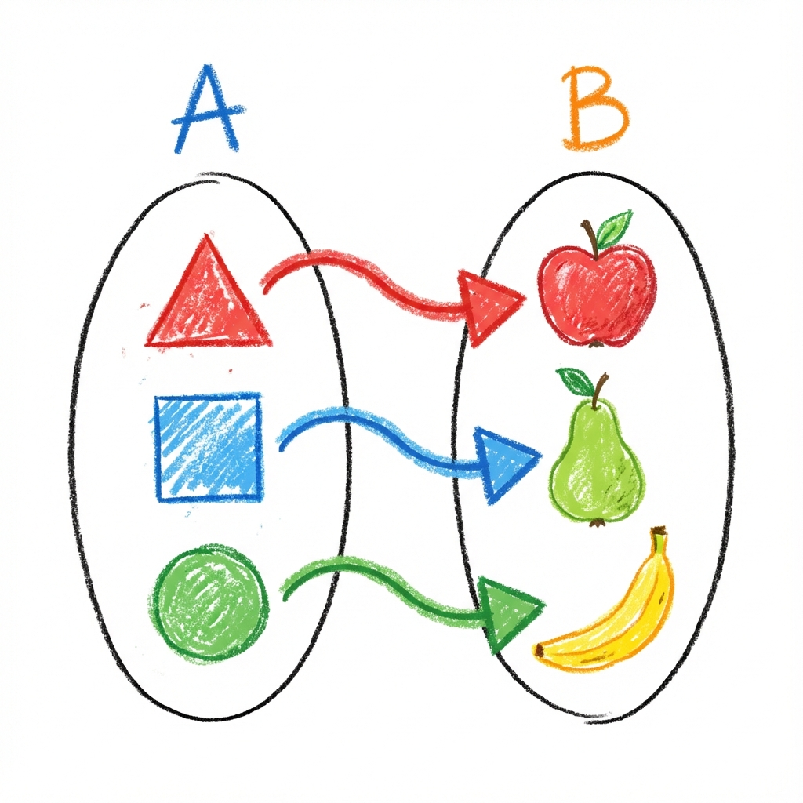

---

# אם $A \sim B$ אז $\mathcal{P}(A) \sim \mathcal{P}(B)$.

- נניח  ש-$f \colon A \to B$ היא חד-חד-ערכית ועל.

- נגדיר את הפונקציה 
$g \colon \mathcal{P}(A) \to \mathcal{P}(B)$
על ידי הכלל 
$g(S) = f[S]$ 
לכל $S \subseteq A$.

- $g$ היא חד-חד-ערכית:
  - נניח $g(S_1) = g(S_2)$ עבור $S_1, S_2 \subseteq A$.
  
  - אז $f[S_1] = f[S_2]$.
  - מכיוון ש-$f$ היא חד-חד-ערכית, נובע ש-$S_1 = S_2$:
    - עבור $i \in \{1, 2\}$, אם $x \in S_i$ אז $f(x) \in f[S_i]$

    - מכיוון ש-$f[S_{(2-i)+1}] = f[S_i]$, נובע ש-$f(x) \in f[S_{(2-i)+1}]$
    - מכיוון ש-$f$ חד-חד-ערכית, נובע ש-$x \in S_{(2-i)+1}$.
  

- $g$ היא על:
  - תהי $T \subseteq B$.
  
  - נגדיר 
  $S = f^{-1}[T]$.
  - אז $g(S) = T$.

  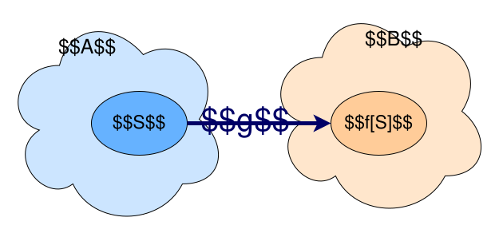

---

# אם קיימת פונקציה "על" מקבוצה $B$ לקבוצה $A$, אז $A \curlyeqprec B$

- נניח $f\colon B \to A$ היא פונקציה על.

- נגדיר את הפונקציה $g\colon A \to B$ כך:
  - עבור כל $a \in A$, נבחר $b_a \in B$ כך ש-$f(b_a) = a$ (אפשר לעשות זאת כי $f$ היא פונקציה על).

  - נגדיר $g(a) = b_a$.

- נראה ש-$g$ היא פונקציה חד-חד-ערכית:
  - נניח $g(a_1) = g(a_2)$ עבור $a_1, a_2 \in A$.

  - אז $b_{a_1} = b_{a_2}$.

  - מכיוון ש-$f(b_{a_1}) = a_1$ ו-$f(b_{a_2}) = a_2$, נובע ש-$a_1 = a_2$.

- מכאן נובע ש-$g$ היא פונקציה חד-חד-ערכית, ולכן $A \curlyeqprec B$.

  הטענה הזו היא "אם ורק אם" כל עוד $A$ לא ריקה.
    
  למשל, עבור $A=\emptyset$ ו-$B=\{1\}$, מתקיים $A \curlyeqprec B$ (פונקציה ריקה), אך לא קיימת פונקציה מ-$B$ ל-$A$.

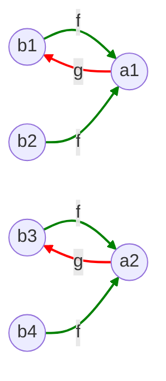
```mermaid
graph LR

b1((b1)) --> |f| a1((a1))
b2((b2)) --> |f| a1
b3((b3)) --> |f| a2((a2))
b4((b4)) --> |f| a2

a1 --> |g| b1
a2 --> |g| b3

linkStyle 0,1,2,3 stroke:green,stroke-width:2px,head-color:green
linkStyle 4,5 stroke:red,stroke-width:2px,arrowhead-color:red
```

---

# אם $E$ יחס שקילות מעל $A$, אז $A/E \curlyeqprec A$

- נניח $E$ הוא יחס שקילות מעל $A$.

- נגדיר את הפונקציה $f \colon A \to A/E$ כך: $f(a) = [a]$ לכל $a \in A$.

- נראה ש-$f$ היא פונקציה על:

  - נניח $[a] \in A/E$.

  - אז $f(a) = [a]$ ולכן $[a] \in \text{image}(f)$.

  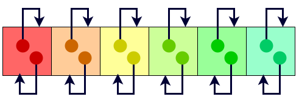

---

# תרגיל לדוגמא: אם $A \sim B$ וגם $C \sim D$ אז $A \times C \sim B \times D$

---
layout: two-cols-header
---

# תרגיל לדוגמא: אם $A \sim B$ וגם $C \sim D$ אז $A \times C \sim B \times D$

- נניח $f \colon A \to B$ ו-$g \colon C \to D$ הן פונקציות חד-חד-ערכיות ועל.

- נגדיר פונקציה $h \colon A \times C \to B \times D$ על ידי:
  $$h(\langle a, c \rangle) = \langle f(a), g(c) \rangle$$

- נראה ש-$h$ היא חד-חד-ערכית ועל:

::left::

  - **חד-חד-ערכית:** 
    - נניח $h(\langle a_1, c_1 \rangle) = h(\langle a_2, c_2 \rangle)$.

    - אז $\langle f(a_1), g(c_1) \rangle = \langle f(a_2), g(c_2) \rangle$.
    - לכן $f(a_1) = f(a_2)$ וגם $g(c_1) = g(c_2)$.
    - מכיוון ש-$f$ ו-$g$ חח"ע, נובע $a_1 = a_2$ ו-$c_1 = c_2$.
    - לכן $\langle a_1, c_1 \rangle = \langle a_2, c_2 \rangle$.

::right::

  - **על:**
    - יהי $\langle b, d \rangle \in B \times D$.

    - מכיוון ש-$f$ ו-$g$ על, קיימים $a \in A$ ו-$c \in C$ כך ש-$f(a)=b$ ו-$g(c)=d$.
    - לכן $h(\langle a, c \rangle) = \langle f(a), g(c) \rangle = \langle b, d \rangle$.

---
section: קנטור ברנשטיין
---

# טענת עזר: אם $X \subseteq Y$ ויש $f\colon Y \to X$ שהיא חד-חד-ערכית אז $X \sim Y$.

- נגדיר קבוצות $E_n$ באופן רקורסיבי:
  $$E_0 = Y \setminus X$$
  $$E_{i+1} = f[E_i] = \{f(a) : a \in E_i\}$$
- נגדיר 
$$E = \bigcup \{ E_i \mid i \in \mathbb{N} \}$$
- נגדיר את הפונקציה $h \colon Y \to X$ כך:
  $$h(y) = \begin{cases} 
      f(y) & \text{if } y \in E \\
      y & \text{if } y \in Y \setminus E 
  \end{cases}$$

- טענה: $h$ היא פונקציה חד-חד-ערכית ועל.

  

    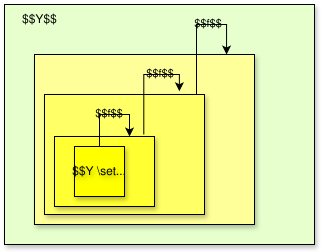
  

---

# המשך טענת העזר

- $h$ היא פונקציה חד-חד-ערכית:
   - נניח $h(y_1) = h(y_2)$. נראה כי $y_1 = y_2$. יש שלוש אפשרויות:
     
     1. $y_1, y_2 \in E$:  אז $f(y_1) = h(y_1) = h(y_2) = f(y_2)$. מכיוון ש-$f$ חד-חד-ערכית, נובע $y_1 = y_2$.

     2. $y_1, y_2 \in Y \setminus E$: אז $y_1 = h(y_1) = h(y_2) = y_2$. לכן $y_1 = y_2$.

     3. $y_1 \in E$ ו-$y_2 \in Y \setminus E$: נראה שמקרה זה לא ייתכן. במקרה זה $f(y_1) = h(y_1) = h(y_2) = y_2$. מכיוון ש-$y_1 \in E$, יש $n \in \mathbb{N}$ כך ש-$y_1 \in E_n$. אז $y_2 = f(y_1) \in E_{n+1} \subseteq E$. קיבלנו $y_2 \in E$, בסתירה לכך ש-$y_2 \in Y \setminus E$.

- $h$ היא פונקציה על:
   - נניח $x \in X$. אם $x \in Y \setminus E$, אז $h(x) = x$ ולכן $x \in \text{image}(h)$. אם $x \in E$, אז $x \in E_n$ עבור $n \in \mathbb{N}$. מכיוון ש-$E_0 = Y \setminus X$, $x \notin E_0$, ולכן $n > 0$. אם $x \in E_n$ עבור $n > 0$, אז לפי הגדרת $E_n$, יש $y \in E_{n-1}$ כך ש-$x = f(y)$. מכיוון ש-$y \in E_{n-1}$, $y \in E$ ולכן $h(y) = f(y) = x$ ולכן $x \in \text{image}(h)$.

מכאן נובע ש-$h$ היא פונקציה חד-חד-ערכית ועל, ולכן $X \sim Y$.

---

# משפט קנטור ברנשטיין: אם $A \curlyeqprec B$ ו-$B \curlyeqprec A$, אז $A \sim B$.

  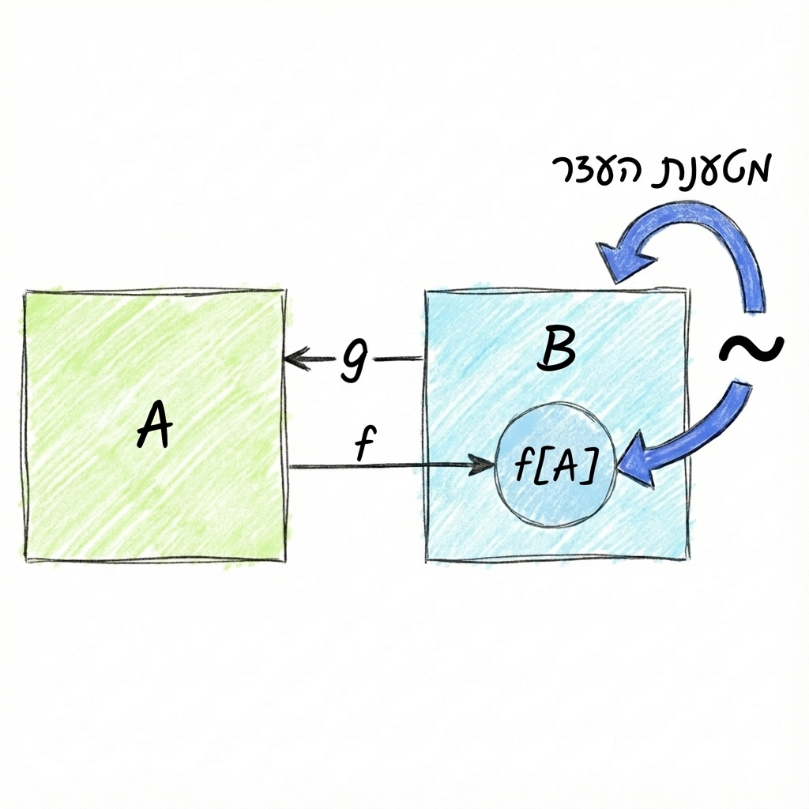 

---

# משפט קנטור ברנשטיין: אם $A \curlyeqprec B$ ו-$B \curlyeqprec A$, אז $A \sim B$.

### הוכחה:

- נניח $A$ ו-$B$ הן קבוצות ויש פונקציות חד-חד-ערכיות $f\colon A \to B$ ו-$g\colon B \to A$.

- $f \circ g$ היא הרכבה של שתי פונקציות חד-חד-ערכיות ולכן היא חד-חד-ערכית.

- היא פונקציה מ-$B$ ל-$f[A]$

- לפי טענת העזר נובע ש-$f[A] \sim B$.

- $f$ היא פונקציה חד-חד-ערכית ועל מ-$A$ ל-$f[A]$, ולכן $A \sim f[A]$.

- מטרנזיטיביות $\sim$ נובע ש-$A \sim B$.

  

     
  

---
section: קבוצות אינסופיות
---

# $\mathbb{N}$ אינה קבוצה סופית

- נניח בשלילה ש-$\mathbb{N}$ היא קבוצה סופית.

- אזי קיים $n \in \mathbb{N}$ כך ש-$\mathbb{N} \sim \mathbb{N}^{<n}$.
- תהי $f\colon \mathbb{N}^{<n} \to \mathbb{N}$ פונקציה חד-חד-ערכית ועל.
- נגדיר $M = \max(\{f(i) \mid i < n\}) + 1$.
- מצד אחד, $M \in \mathbb{N}$ (סגירות לחיבור).
- מצד שני, לכל $i < n$, מתקיים $f(i) < f(i) + 1 \leq M$, ולכן $f(i) \neq M$.
- כלומר, $M \notin \text{image}(f)$.
- בסתירה לכך ש-$f$ היא פונקציה על. 
- לכן $\mathbb{N}$ אינה סופית.

  

    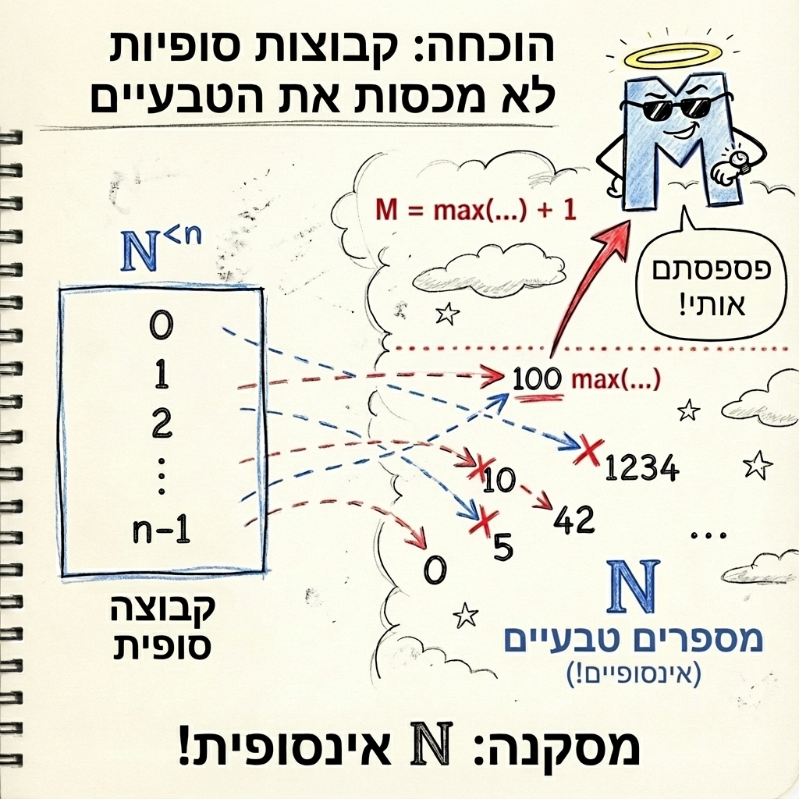
  

---
layout: TwoColsHeaderCustom
---

# אם קיימת $f\colon A \to A$ חד-חד-ערכית ולא על, אז $\mathbb{N} \curlyeqprec A$

- נגדיר סדרה $a_0, a_1, \dots$ באופן הבא:
  - נבחר $a_0 \in A \setminus \text{image}(f)$.
  - לכל $n \in \mathbb{N}$, נגדיר $a_{n+1} = f(a_n)$.

- נגדיר $g\colon \mathbb{N} \to A$ על ידי $g(n) = a_n$.

- נראה ש-$g$ היא חד-חד-ערכית: נניח בשלילה ש-$g$ אינה חח"ע. יהיו $n < m$ המקיימים $g(n) = g(m)$.
  - נבחר את הזוג המינימלי (עבור ה-$n$ הקטן ביותר) המקיים זאת.
  
::left::

 - אם $n = 0$: 
    - אזי $a_0 = g(0) = g(m) = f(a_{m-1})$.
    - סתירה, כי $a_0 \notin \text{image}(f)$ לפי הבחירה.
  
::right::

  - אם $n > 0$: 
    - אז גם $m > 0$. מתקיים $f(a_{n-1}) = a_n = a_m = f(a_{m-1})$.
    - מכיוון ש-$f$ היא חח"ע, נובע ש-$g(n-1) = a_{n-1} = a_{m-1} = g(m-1)$.
    - סתירה למינימליות של $n$.

::after::

- מכאן נובע ש-$g$ היא פונקציה חד-חד-ערכית, ולכן $\mathbb{N} \curlyeqprec A$.

---

# דוגמה: קבוצת הפולינומים $\mathbb{Z}[x]$ היא אינסופית

- נסמן ב-$\mathbb{Z}[x]$ את קבוצת הפולינומים עם מקדמים שלמים.
  
- נגדיר פונקציה $f\colon \mathbb{Z}[x] \to \mathbb{Z}[x]$ על ידי: 
  $$f(P(x)) = x \cdot P(x)$$

- **$f$ היא חד-חד-ערכית:**
  - אם $x \cdot P(x) = x \cdot Q(x)$, אז $P(x) = Q(x)$ (כי פולינומים שווים אם המקדמים שווים).

- **$f$ אינה על:**
  - הפולינום הקבוע $1$ אינו בטווח של $f$, כי לכל פולינום $Q(x)$ בטווח, $Q(0) = 0 \cdot P(0) = 0$, ועבור הפולינום הקבוע $1$, הערך ב-$0$ הוא $1$.

- **מסקנה:**
  - קיימת פונקציה חח"ע ולא על מ-$\mathbb{Z}[x]$ לעצמה.
  - לכן לפי המשפט הקודם, $\mathbb{N} \curlyeqprec \mathbb{Z}[x]$.
  - כלומר, $\mathbb{Z}[x]$ היא קבוצה אינסופית.

---
section: קבוצות בנות מנייה
---

# קבוצות בנות מנייה

- קבוצה $A$ נקראת בת מנייה אם $A$ סופית או $A \sim \mathbb{N}$.

- אם $A \sim \mathbb{N}$ נאמר ש-$A$ היא בת מנייה אינסופית או $|A| = \aleph_0$  ונאמר שהגודל (העוצמה) של $A$ הוא $\aleph_0$.

- דוגמאות:
  - $2\mathbb{N} = \{0, 2, 4, 6, \ldots\}$ היא קבוצה בת מנייה.
    - כדי לראות זאת, נבחן את הפונקציה $f \colon \mathbb{N} \to 2\mathbb{N}$ כאשר $f(x) = 2x$.
    - קל להוכיח שפונקציה זו היא חד-חד-ערכית ועל.

  - $\mathbb{Z}$ היא קבוצה בת מנייה:
    - נבחן את הפונקציה $f \colon \mathbb{N} \to \mathbb{Z}$
      $$f(x) = \begin{cases} 
          \frac{x+1}{2} &  \text{ אי-זוגי} \, x \, \text{אם } \\
          -\frac{x}{2} &  \text{ זוגי}\, x \,  \text{אם }
        \end{cases}$$

    - קל להוכיח שפונקציה זו היא חד-חד-ערכית ועל.
  
  

    

      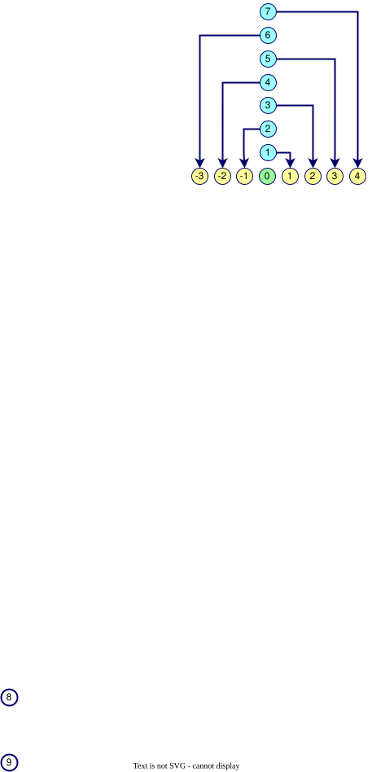
    

  

---
layout: TwoColsHeaderCustom
---

# $A$ בת מנייה אם ורק אם $A \curlyeqprec \mathbb{N}$

- ($\Rightarrow$) אם $A$ היא בת מנייה אז $A$ סופית או $A \sim \mathbb{N}$.
  - אם $A$ סופית, אז קיימת פונקציה חח"ע ועל $f\colon A \to \mathbb{N}^{<n}$ עבור $n \in \mathbb{N}$ כלשהו. זאת פונקציה חח"ע מ-$A$ ל-$\mathbb{N}$ ולכן $A \curlyeqprec \mathbb{N}$.
  - אם $A \sim \mathbb{N}$ אז כפי שראינו קודם $A \curlyeqprec \mathbb{N}$.

- ($\Leftarrow$) אם $A \curlyeqprec \mathbb{N}$, אז קיימת פונקציה חד-חד-ערכית $f\colon A \to \mathbb{N}$. נחלק את ההוכחה לשני מקרים: 

::left::

  - **מקרה 1:** $f[A]$ חסומה.
    - במקרה זה, $f[A] \subseteq \mathbb{N}$ היא תת-קבוצה חסומה ולכן סופית.
    
    - קיים $n \in \mathbb{N}$ ופונקציה חח"ע ועל $g\colon f[A] \to \mathbb{N}^{<n}$.
    - הפונקציה המורכבת $g \circ f \colon A \to \mathbb{N}^{<n}$ היא חח"ע ועל.
    - לכן $A$ סופית, ובפרט בת מנייה.

::right::

  - **מקרה 2:** $f[A]$ אינה חסומה.
    - נגדיר פונקציה $g\colon \mathbb{N} \to f[A]$ באופן אינדוקטיבי:
      $$ g(i) = \min(f[A] \setminus \{g(0), \ldots, g(i-1)\}) $$
    - הפונקציה מוגדרת לכל $i\in \mathbb{N}$ כי $f[A]$ אינה חסומה.
    - נוכיח, בשקף הבא, ש-$g$ היא פונקציה חח"ע ועל.

    - לכן $f[A] \sim \mathbb{N}$. מכיוון ש-$f$ היא חח"ע ועל מ-$A$ ל-$f[A]$, אז $A \sim f[A]$.
     מטרנזיטיביות יחס השקילות, נקבל $A \sim \mathbb{N}$.

---
layout: TwoColsHeaderCustom
---

# המשך  

- נראה ש-$g$ היא פונקציה חד-חד-ערכית ועל:

::left::

- **$g$ היא חד-חד-ערכית:** 
  - נניח $g(i) = g(j)$. נרצה להראות ש-$i = j$.

  - נניח בשלילה ש-$i \neq j$. בה"כ נניח $i < j$.
  - לפי הגדרת $g$, מתקיים $g(j) = \min(f[A] \setminus \{g(0), \dots, g(j-1)\})$.
  - בפרט $g(j) \notin \{g(0), \dots, g(j-1)\}$.
  - מצד שני, מכיוון ש-$i < j$, מתקיים $g(i) \in \{g(0), \dots, g(j-1)\}$.
  - לכן $g(j) \neq g(i)$, סתירה להנחה.
  - מכאן ש-$i = j$.

::right::

<small>

- **$g$ היא על:**

  - יהי $y \in f[A]$. נתבונן בקבוצה $\{g(0), \dots, g(y)\}$.
  
  - זוהי קבוצה של $y+1$ מספרים טבעיים שונים (כי $g$ חח"ע).
  - נניח בשלילה ש-$y$ אינו בתמונה של $g$ (עד $y$). אז לכל $k \le y$ מתקיים $g(k) \neq y$.
  - לפי הגדרת המינימום, לכל $k \le y$, $g(k) < y$ 
   
  (כי $y \in f[A]$ והוא לא נבחר, אז המינימום קטן ממנו).
  - קיבלנו $y+1$ מספרים טבעיים שונים שכולם קטנים ממש מ-$y$. זאת סתירה כי יש רק $y$ מספרים טבעיים הקטנים מ-$y$: $0, \dots, y-1$.
  - לכן $y \in \{g(0), \dots, g(y)\}$, כלומר קיימת $i \le y$ כך ש-$g(i) = y$.

</small>

---

# אם $A$ בת מנייה ו-$A' \subseteq A$, אז $A'$ בת מנייה

  

    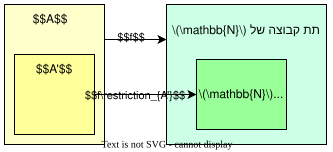
  

---

# אם $A$ בת מנייה ו-$A' \subseteq A$, אז $A'$ בת מנייה

- הראינו ש-$A$ היא בת מנייה אם ורק אם $A \curlyeqprec \mathbb{N}$.

- נניח $f\colon A \to \mathbb{N}$ היא פונקציה חד-חד-ערכית המעידה על כך.

- כעת נבחן את הפונקציה המצומצמת $f\restriction_{A'}\colon A' \to \mathbb{N}$.

- פונקציה זו עדיין חד-חד-ערכית ולכן $A' \curlyeqprec \mathbb{N}$ ומכאן ש-$A'$ בת מנייה.

  

    
  

---

# איחוד סופי של קבוצות בנות מנייה הוא קבוצה בת מנייה

  

    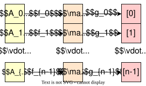
  

---

# איחוד סופי של קבוצות בנות מנייה הוא קבוצה בת מנייה

- נניח $A_0, A_1, \ldots, A_{n-1}$ הן קבוצות בנות מנייה.
- מכיוון שאיחוד סופי של קבוצות סופיות הוא סופי ואיחוד של קבוצה סופית וקבוצה בת מנייה הוא בת מנייה, נניח ללא הגבלת הכלליות ש-$A_0, A_1, \ldots, A_{n-1}$ הן בנות מנייה אינסופיות.

-   נתחיל במקרה המיוחד שבו $A_0, A_1, \ldots, A_{n-1}$ זרות בזוגות. 
  - נניח $A_0, A_1, \ldots, A_{n-1}$ זרות בזוגות ובנות מנייה אינסופיות.
  - אז קיימות פונקציות חד-חד-ערכיות ועל $f_i: A_i \to \mathbb{N}$.
  - נבחן את $\mathbb{N}/R$ באשר $R$ היחס $R = \{ \langle i, j \rangle \mid j \equiv m \pmod n\}$.
  - זוהי קבוצת מחלקות השקילות $[0], [1], \ldots, [n-1]$. כל אחת ממחלקות אלו היא תת-קבוצה אינסופית של $\mathbb{N}$ ולכן כולן בנות מנייה אינסופיות ו-$\mathbb{N} \sim [i]$ לכל $0 \leq i \leq n-1$.
  - נניח $g_i: \mathbb{N} \to [i]$ הן פונקציות חד-חד-ערכיות ועל המעידות על כך.
  - נבחן את הפונקציה $h: \bigcup_{i=0}^{n-1} A_i \to \mathbb{N}$ המוגדרת כ-$h(a) = g_i(f_i(a))$ אם $a \in A_i$.
  - לכל $i$, $g_i \circ f_i$ היא פונקציה חד-חד-ערכית ועל מ-$A_i$ ל-$[i]$
  - מכיוון שהתחומים והתמונות זרות בזוגות ואיחוד התמונות הוא 
    $\mathbb{N}$,  
    $h$ היא פונקציה חד-חד-ערכית ועל.

  

    
  

---

# המשך

- כעת נבחן את המקרה שבו $A_i$ אינן בהכרח זרות בזוגות. נגדיר סדרה חדשה של קבוצות  $B_0, B_1, \ldots, B_{n-1}$ כך:
  $$ B_0 = A_0, \quad B_i = A_i \setminus \bigcup_{j=0}^{i-1} B_j $$

  1. **שוויון האיחודים:** $\bigcup_{i=0}^{n-1} A_i = \bigcup_{i=0}^{n-1} B_i$
     - ברור ש-$B_i \subseteq A_i$, לכן $\bigcup B_i \subseteq \bigcup A_i$.
     - מצד שני, אם $a \in \bigcup A_i$, נבחר את האינדקס המינימלי $m$ כך ש-$a \in A_m$.
     - אז $a \notin A_k$ לכל $k < m$, ובפרט $a \notin B_k$.
     - לכן $a \in A_m \setminus \bigcup_{j=0}^{m-1} B_j = B_m$.

  2. **זרות בזוגות:** $B_i \cap B_j = \emptyset$ לכל $i \neq j$.
     - נניח $i > j$. לפי ההגדרה, $B_i$ מכילה רק איברים שאינם ב-$B_j$ (שהרי $B_j \subseteq \bigcup_{k=0}^{i-1} B_k$).

- לפי מה שראינו בשקף הקודם, $\bigcup_{i=0}^{n-1} B_i$ היא קבוצה בת מנייה אינסופית ולכן $\bigcup_{i=0}^{n-1} A_i$ היא קבוצה בת מנייה אינסופית.

  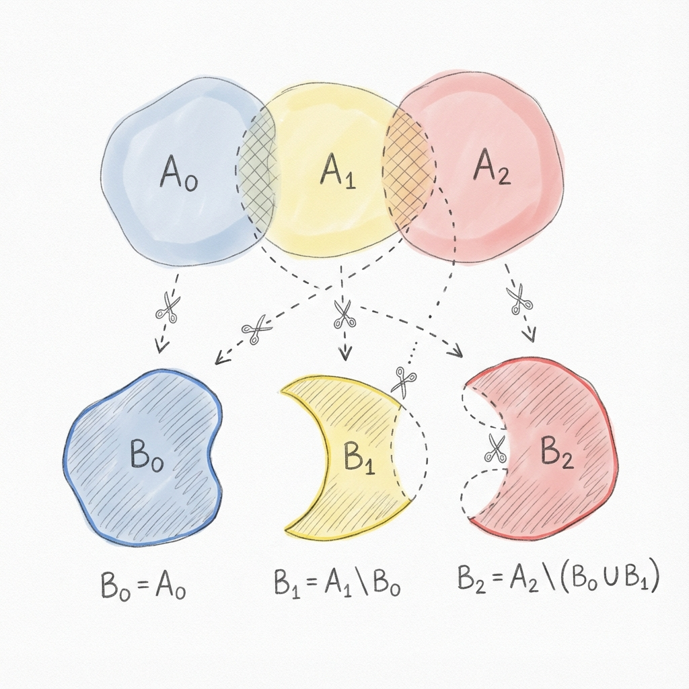

---
section: הרציונליים
---

# $\mathbb{N} \times \mathbb{N}$ היא קבוצה בת מנייה

  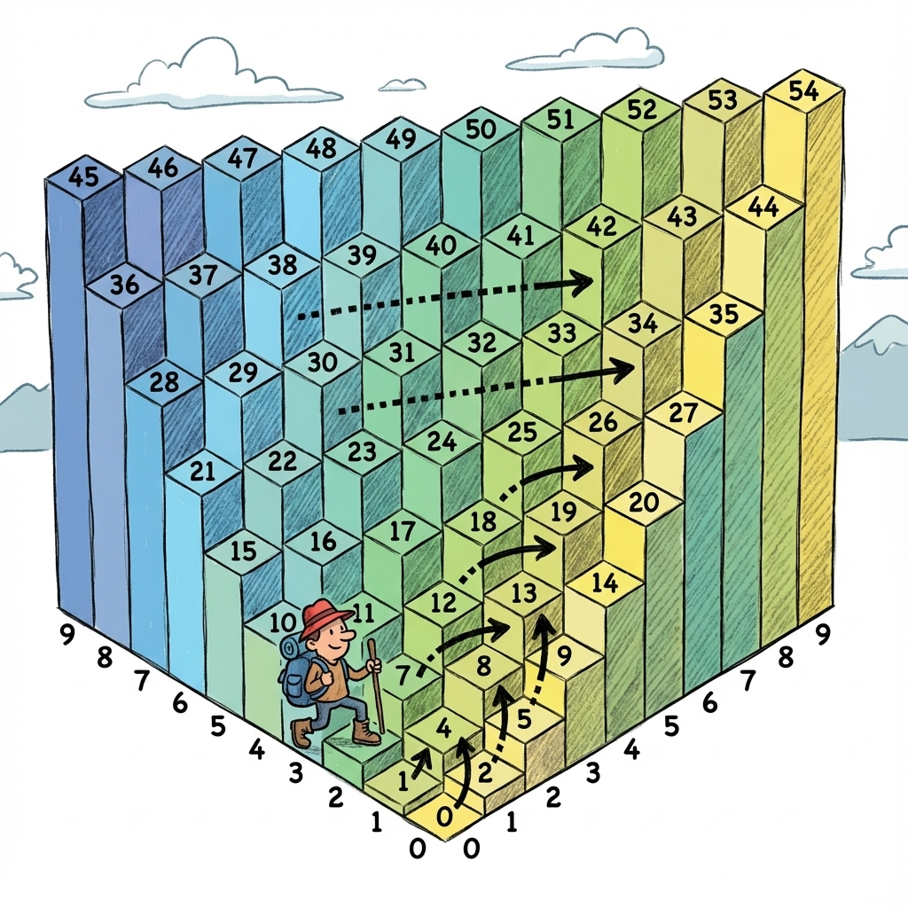

- נגדיר את הפונקציה $f\colon \mathbb{N} \times \mathbb{N} \to \mathbb{N}$ כך:
  $$f(x, y) = \frac{(x+y)(x+y+1)}{2} + y$$

- זאת פונקציה חד-חד ערכית ועל:

---

# הגדרת זוגות באופן רקורסיבי

נתחיל עם:
 $$C(0) = (0, 0)$$

ונמשיך באופן אינדוקטיבי:
$$C(i+1) = \begin{cases} 
    \langle y+1, 0  \rangle &  C(i)=\langle 0,y \rangle \\
    \langle x-1, y+1\rangle &  C(i)=\langle x,y \rangle, x\neq 0
  \end{cases}$$

1. פונקציית הזיווג ממפה באופן שיטתי את הזוגות $\langle x, y\rangle$ על ידי מעבר על האלכסונים של $\mathbb{N} \times \mathbb{N}$.

2. בתוך כל אלכסון, הזוגות מזוהים באופן ייחודי מכיוון ש:
    - כל אלכסון $d$ מתאים לכל הזוגות $\langle x, y\rangle$ כך ש-$x + y = d$.
    - הזוגות על האלכסון $d$ ממופים בסדר קבוע שמתחיל מ-$\langle d, 0\rangle$ ונע שמאלה לאורך $\langle d-1, 1 \rangle, \langle d-2, 2\rangle, \dots, \langle 0, d  \rangle$.
3. מכיוון שהמיפוי מתחיל מ-$\langle 0, 0 \rangle$ ועובר באופן שיטתי על כל האלכסונים, אף זוג לא חוזר על עצמו.
4. לכן זאת פונקציה חד-חד ערכית ועל.

  

    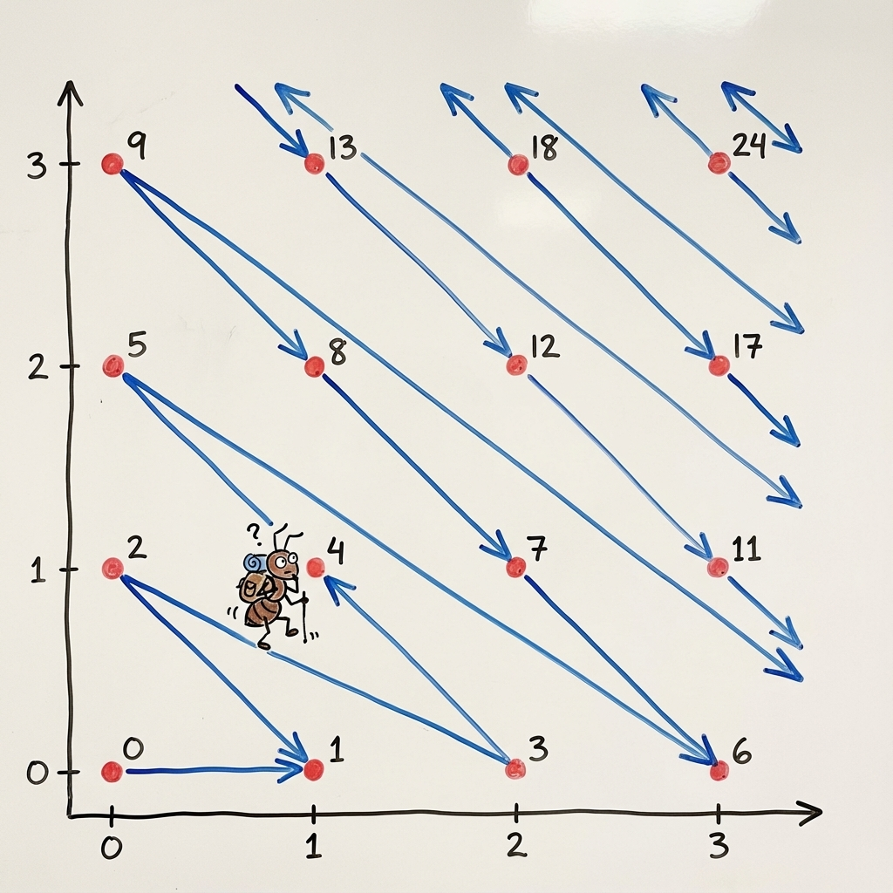
  

---

# מסקנה: $\mathbb{Q}$ היא קבוצה בת מנייה

$$\mathbb{Q} = (\mathbb{N} \times \mathbb{N}) / R$$

באשר

$$R = \{ \langle \langle a_1, b_1 \rangle, \langle a_2, b_2 \rangle \rangle \mid a_1 \cdot b_2 = a_2 \cdot b_1 \}$$

הוכחנו שמרחב המנה קטן עוצמה מהמרחב עצמו לכל יחס ולכן

$$\mathbb{Q} \curlyeqprec \mathbb{N} \times \mathbb{N} \sim \mathbb{N}$$

הוכחנו גם שכל קבוצה שהיא קטנת עוצמה מקבוצה בת-מנייה היא בת מנייה 
 לכן
$\mathbb{Q}$ היא בת מנייה.

---
section: אריתמטיקת עוצמות
---

# איחוד של קבוצה בת מניה של קבוצות בנות מנייה הוא בן מנייה

- נניח שיש לנו קבוצה בת מנייה של קבוצות בנות מנייה: $A = \{A_n \mid n \in \mathbb{N}\}$

- נבנה פונקציה $h \colon \mathbb{N} \times \mathbb{N} \to \bigcup A$ שהיא על.
- כל $A_i$ היא קבוצה בת מנייה, ולכן נבחר פונקציה $g_i \colon \mathbb{N} \to A_i$ שהיא על. 
<!-- (היכולת שלנו לבחור פונקציות אלו נובעת מאקסיומת הבחירה). -->

- כעת נגדיר את $h$ כך:  $h(\langle a, b \rangle) = g_a(b)$

- $h$ היא על:
  - יהי $a \in \bigcup A$.
  - אזי $a \in A_i$ עבור איזה שהוא $i \in \mathbb{N}$.
  - לכן, $a \in \text{image}(g_i)$ ולכן קיים $m \in \mathbb{N}$ כך ש-$a = g_i(m)$.
  - מכאן ש-$h(\langle i, m \rangle) = a$.

- לכן $\bigcup A \curlyeqprec \mathbb{N} \times \mathbb{N} \sim \mathbb{N}$.
 
- לכן $\bigcup A$ בת מנייה.

  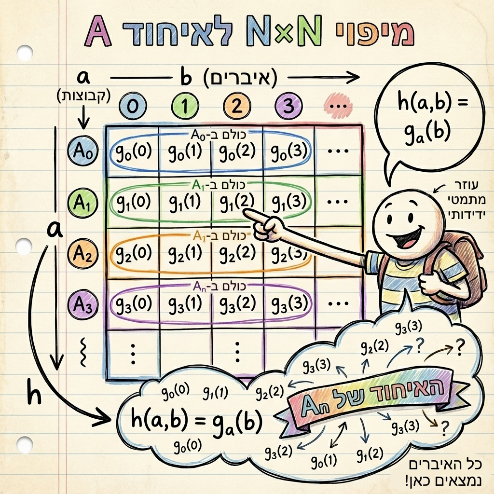

---

# מכפלה קרטזית של $n$   קבוצות

- יהיו $A_1, \ldots, A_n$ קבוצות.
  נרחיב את הגדרת המכפלה הקרטזית של $n$ קבוצות:
  $$A_1 \times \cdots \times A_n = \{ \langle a_1, \ldots, a_n \rangle \mid a_1 \in A_1, \ldots, a_n \in A_n\}$$

- האלמנטים של קבוצות אלו נקראים $n$-יות. אניה בת 2 אברים היא פשוט זוג סדור. האקדמיה העברית קיבלה את המילה "סדורה" במקום אניה.
  
- המכפלה הקרטזית של הקבוצה הריקה עם כל קבוצה אחרת היא כמובן ריקה.
  
- **המכפלה הקרטזית של $n$ קבוצות בנות מנייה היא בת מנייה**:
   - בסיס האינדוקציה: מכפלה של שתי קבוצות בנות מנייה היא בת מנייה.
   
   - צעד אינדוקציה:   נניח שהמכפלה $A_1 \times A_2 \times \dots \times A_k$ היא בת מנייה.
     - נוסיף קבוצה נוספת $A_{k+1}$ ונקבל ש
      $
      (A_1 \times A_2 \times \dots \times A_k) \times A_{k+1}
      $
      היא בת מנייה לפי המקרה של שתי קבוצות.

     -  קל לראות שהפונקציה $f\colon A_1 \times A_2 \times \dots \times A_k \times A_{k+1} \to (A_1 \times A_2 \times \dots \times A_k) \times A_{k+1}$ המקיימת 
     $f(\langle a_1, \ldots, a_k, a_{k+1} \rangle) = \langle \langle a_1, \ldots, a_k \rangle, a_{k+1} \rangle$
     היא חד-חד-ערכית ועל.

---

# $\text{FinSeq}(\mathbb{N})$ היא קבוצה בת מנייה

  $$\text{FinSeq}(\mathbb{N}) = \bigcup \{ \mathbb{N}^m \mid m \in \mathbb{N} \} =    \bigcup \bigl\{ \{\langle a_1, \ldots, a_m \rangle  \mid a_i \in \mathbb{N}\} \mid m \in \mathbb{N}\bigr\}$$

- היא איחוד בן מנייה של קבוצות בנות מנייה ולכן היא בת מנייה.

- אפשר לחשוב על $\text{FinSeq}(\mathbb{N})$ כעל קבוצת כל הרצפים הסופיים של מספרים טבעיים.

- גם כל הפונקציות מ-
  $$\bigcup \{  \mathbb{N}^{\mathbb{N}^{<n}} \mid n \in \mathbb{N} \}$$

- איך נתאים בין שתי הקבוצות באופן חד-חד ערכי ועל?

---
layout: TwoColsHeaderCustom
cols: 1fr 2fr
---

# $\text{Fin}(\mathbb{N})$ היא קבוצה בת מנייה

<small>

- **הגדרנו את $\text{Fin}(\mathbb{N})$ באופן אינדוקטיבי:**
   1. $\emptyset \in \text{Fin}(\mathbb{N})$.
   2. אם $A \in \text{Fin}(\mathbb{N})$ ו-$x \in \mathbb{N}$, אז $A \cup \{x\} \in \text{Fin}(\mathbb{N})$.

- נגדיר את פונקציית הגודל $size \colon \text{Fin}(\mathbb{N}) \to \mathbb{N}$ באופן רקורסיבי:
  - $size(\emptyset) = 0$
  - $size(A \cup \{x\}) = \begin{cases} size(A) + 1 & x \notin A \\ size(A) & x \in A \end{cases}$
  

- כעת ניתן לכתוב את $\text{Fin}(\mathbb{N})$ כאיחוד בן מנייה של הקבוצות בגודל $n$:
  $\text{Fin}(\mathbb{N}) = \bigcup \{\{ A \in \text{Fin}(\mathbb{N}) \mid size(A) = n \} \mid {n \in \mathbb{N}} \}$
 

- נסמן $S_n = \{ A \in \text{Fin}(\mathbb{N}) \mid size(A) = n \}$. נוכיח באינדוקציה שכל $S_n$ היא בת מנייה:

</small>

::left::

<small>

  - **בסיס:** $S_0 = \{\emptyset\}$ היא סופית ולכן בת מנייה.

</small>

  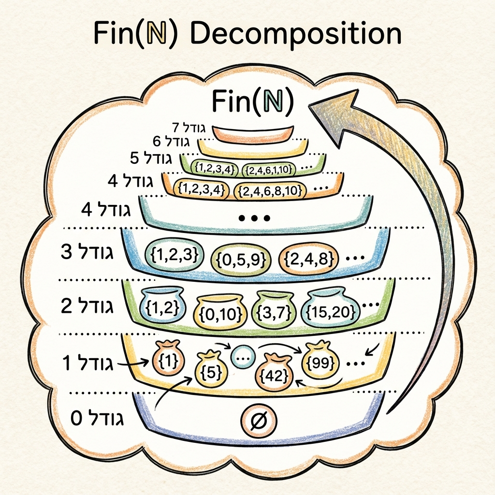

::right::

<small>

  - **צעד:** נניח ש-$S_n$ בת מנייה. כל קבוצה ב-$S_{n+1}$ מתקבלת על ידי הוספת $x$ לקבוצה מ-$S_n$.
  - קיימת פונקציה על $F \colon S_n \times \mathbb{N} \to S_{n+1}$ המוגדרת ע"י $F(A, x) = A \cup \{x\}$.
  - היות ש-$S_n$ ו-$\mathbb{N}$ בנות מנייה, המכפלה שלהן בת מנייה, ולכן התמונה $S_{n+1}$ בת מנייה.

</small>

::after::

<small>

- **מסקנה:** $\text{Fin}(\mathbb{N})$ היא איחוד בן מנייה של קבוצות בנות מנייה ($S_n$), ולכן היא בת מנייה.

</small>

---

# אריתמטיקה של עוצמות (סיכום)

- **הגדרות:**
  
  - **חיבור:** $|A| + |B| = |A \uplus B|$ (איחוד זר).
  - **כפל:** $|A| \cdot |B| = |A \times B|$ (מכפלה קרטזית).
  - **חזקה:** $|A|^{|B|} = |A^B|$ (קבוצת הפונקציות מ-$B$ ל-$A$).

- **תכונות עיקריות:**
  
  - **חילוף וקיבוץ:** חיבור וכפל של עוצמות הם חילופיים וקיבוציים (אסוציאטיביים).
  
  - **פילוג:** הכפל מתפלג מעל החיבור: $\kappa \cdot (\mu + \lambda) = \kappa \cdot \mu + \kappa \cdot \lambda$.

  - **חוקי חזקות:**
    1. $\kappa^{\mu + \lambda} = \kappa^\mu \cdot \kappa^\lambda$
    2. $(\kappa \cdot \mu)^\lambda = \kappa^\lambda \cdot \mu^\lambda$
    3. $(\kappa^\mu)^\lambda = \kappa^{\mu \cdot \lambda}$

  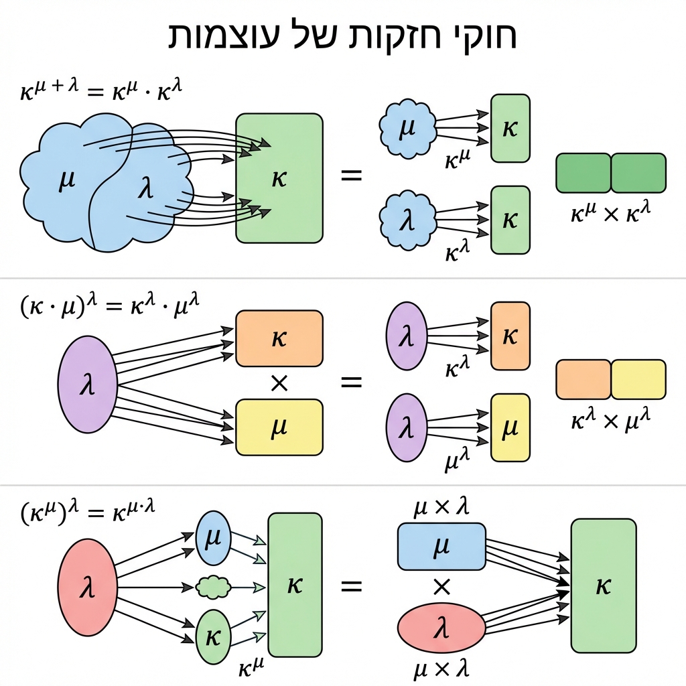

---
section: משפט קנטור
---
# $\mathbb{\{0,1\}^N}$ אינה קבוצה בת מנייה

- נניח בשלילה ש-$\mathbb{\{0,1\}^N}$ היא קבוצה בת מנייה.

- אזי קיימת פונקציה חד-חד-ערכית ועל $f \colon \mathbb{N} \to \mathbb{\{0,1\}^N}$.

- נגדיר פונקציה $g \colon \mathbb{N} \to \{0,1\}$ כך ש-
    
    $g(n) = 1 - f(n)(n)$
  

- מכיוון ש-$f$ היא על, קיים $m \in \mathbb{N}$ כך ש-$f(m) = g$.

- מקבלים: $g(m) = 1 - f(m)(m) = 1 - g(m)$
- קיבלנו סתירה, ולכן ההנחה ש-$\{0,1\}^\mathbb{N}$ היא קבוצה בת מנייה אינה נכונה.

- מכאן ש-$\mathbb{\{0,1\}^N}$ אינה קבוצה בת מנייה.

  

    
  

  

    

      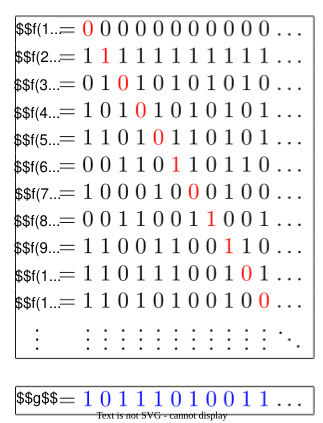
    

  

  

---

# הוכחה שגויה ש-$\mathbb{R}$ אינה קבוצה בת מנייה

- אם $\mathbb{R}$ היתה קבוצה בת מנייה, אזי $[0,1]$ היתה קבוצה בת מנייה.

- נכתוב כל שבר ממשי בטווח $[0,1]$ בצורה של רצף אינסופי של ספרות בבסיס 2 אחרי הנקודה העשרונית. 
  - לדוגמה, $1/2 = 0.1\overline{0}$, $1/3 = 0.\overline{01}$, $3/4 = 0.11\overline{0}$.

- נבנה מספר $r$ באמצעות שיטת האלכסון של קנטור:

  - נניח ש-$f(n) = r_n$ כאשר $r_n$ הוא הייצוג בבסיס 2 של המספר הממשי.

  - נגדיר את הספרה ה-$n$-ית של $r$ להיות שונה מהספרה ה-$n$-ית אחרי הנקודה העשרונית של $r_n$.

- מכיוון ש-$r$ שונה מכל $r_n$  בספרה ה-$n$-ית, $r$ אינו נמצא בתמונה של $f$.

- קיבלנו סתירה, ולכן ההנחה ש-$\mathbb{R}$ היא קבוצה בת מנייה אינה נכונה.

 

  מה לא נכון בהוכחה הזאת?

---

# $\mathbb{R}$ אינה קבוצה בת מנייה - הוכחה נכונה

- נניח בשלילה ש-$\mathbb{R}$ היא קבוצה בת מנייה.

- אזי קבוצת השברים שניתן לכתוב באמצעות הספרות 0 ו-1 בשיטה העשרונית היא בת מנייה:

$$\left\{ \sum_{i=1}^{\infty} d_i 10^{-i} \colon \forall i \in \mathbb{N}( d_i \in \{0,1\}) \right\} \sim \mathbb{N}$$

- כל שבר כזה מיוצג באופן יחיד על ידי רצף אינסופי של ספרות 0 ו-1.

- לכן קיימת פונקציה חד-חד ערכית ועל ממנה לקבוצה $\{0,1\}^\mathbb{N}$:

$$f(\sum_{i=1}^{\infty} d_i 10^{-i})(i) = d_i$$

- בסתירה לכך ש-$\{0,1\}^\mathbb{N}$ אינה בת מנייה.

---

#  $\mathcal{P}(A) \sim \{0,1\}^A$

- נראה כי יש התאמה חד-חד-ערכית ועל בין קבוצת החזקה $\mathcal{P}(A)$ לבין קבוצת הפונקציות מ-$A$ ל-$\left\{0,1\right\}$.

- לכל תת-קבוצה $S \subseteq A$ נתאים את **הפונקציה המציינת** שלה (Indicator Function), $\chi_S \colon A \to \{0,1\}$, המוגדרת כך:
  $$\chi_S(x) = \begin{cases} 
      1 & x \in S \\
      0 & x \notin S 
  \end{cases}$$

- פונקציה זו מחזירה $1$ עבור איברים שנמצאים ב-$S$, ו-$0$ עבור איברים שאינם ב-$S$.
- זוהי התאמה חד-חד-ערכית ועל, ולכן $\mathcal{P}(A) \sim \{0,1\}^A$.

  

    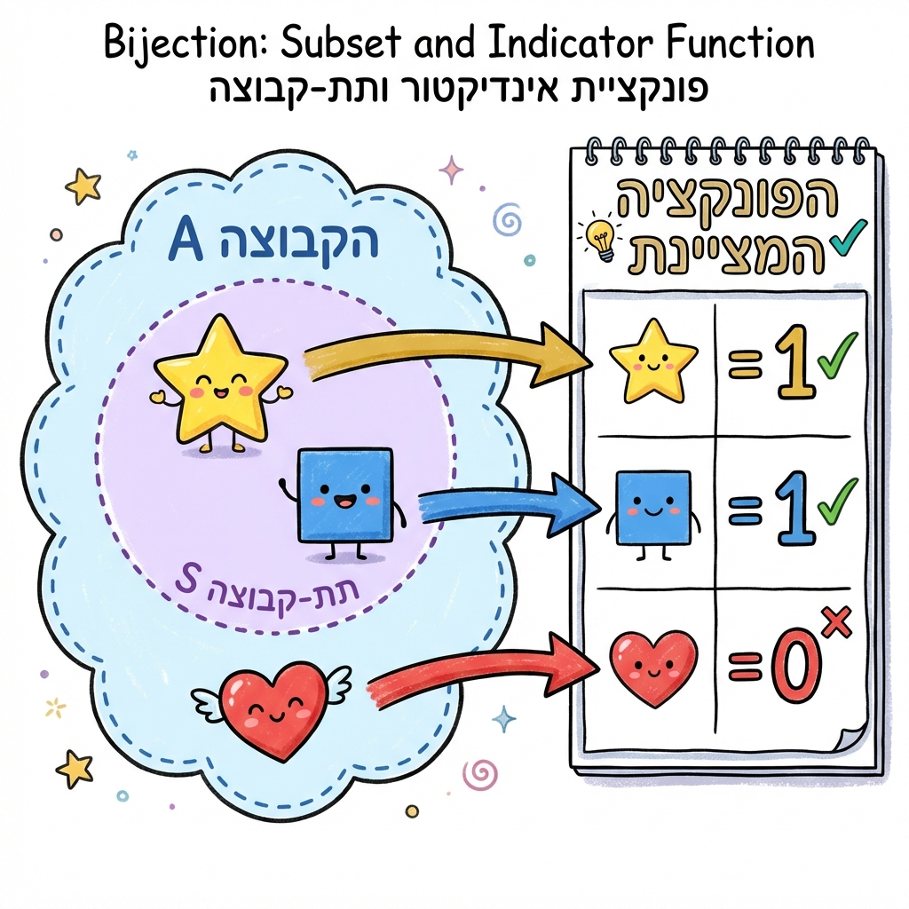
  

---

# משפט קנטור: $\mathcal{P}(A) \not\sim  A$
 
- נניח בשלילה ש-$\mathcal{P}(A) \sim  A$

- אזי קיימת פונקציה חד-חד-ערכית ועל $f \colon A \to \mathcal{P}(A)$.

- נבנה קבוצה $B \subseteq A$  באמצעות הכלל $B = \{a \in A \mid a \notin f(a)\}$.

- מכיוון ש-$f$ היא על, קיים $b \in A$ כך ש-$f(b) = B$.

- נבחן האם $b \in B$:

  - אם $b \in B$, אז לפי הגדרת $B$, $b \notin f(b)$, כלומר $b \notin B$.

  - אם $b \notin B$, אז לפי הגדרת $B$, $b \in f(b)$, כלומר $b \in B$.

- קיבלנו סתירה בשני המקרים, ולכן ההנחה ש-$\mathcal{P}(A) \sim  A$ אינה נכונה.

  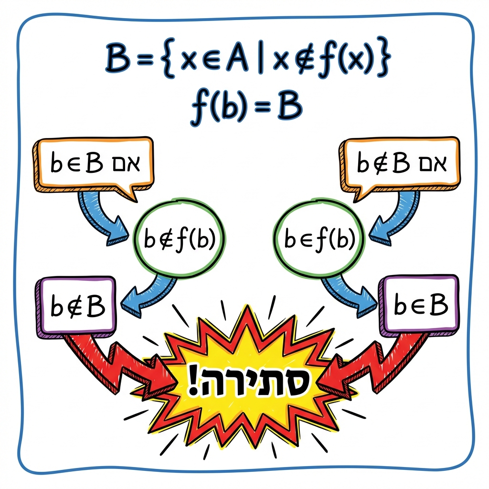

---

# הקטע הפתוח $(0,1)$ שקול לעוצמה של $\mathbb{R}$

- נראה כי $(0,1) \sim \mathbb{R}$ על ידי הצגת פונקציה חד-חד-ערכית ועל.

- נגדיר $f \colon (0,1) \to \mathbb{R}$ ע"י:
  $$f(x) = \tan\left(\pi x - \frac{\pi}{2}\right)$$

- **תכונות הפונקציה:**
  - הפונקציה רציפה ומונוטונית עולה בקטע $(0,1)$.
  - כאשר $x \to 0^+$, $f(x) \to -\infty$.
  - כאשר $x \to 1^-$, $f(x) \to +\infty$.
  - לכן הפונקציה מקבלת כל ערך ממשי בטווח $(-\infty, \infty)$ פעם אחת בדיוק.
  
- מכאן ש-$f$ היא חד-חד-ערכית ועל, ולכן $(0,1) \sim \mathbb{R}$.

  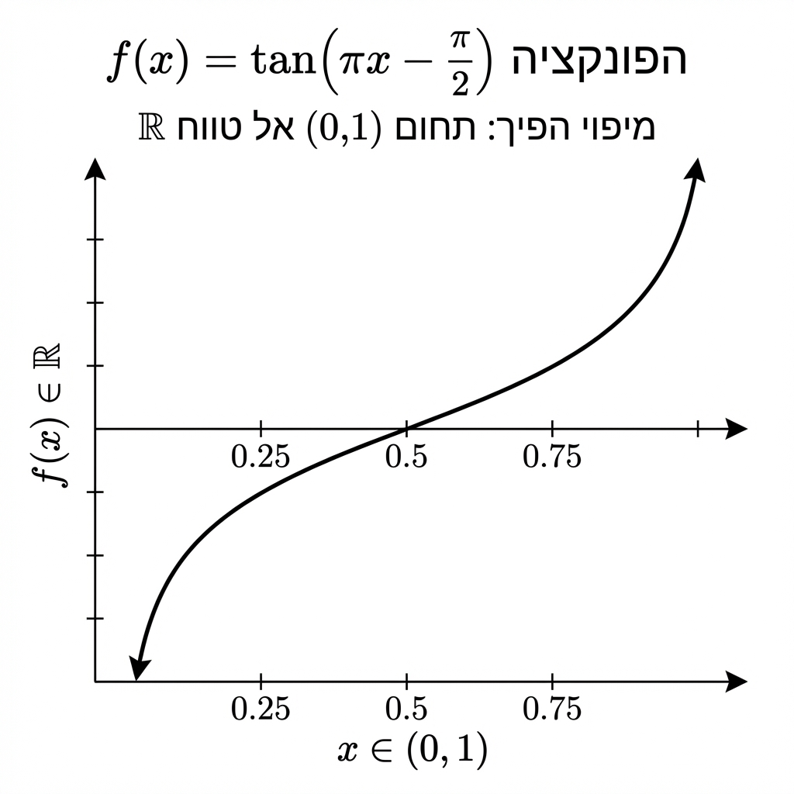

---

#  $\{0,1\}^\mathbb{N} \sim \mathbb{R}$

- כיוון ראשון: $\{0,1\}^\mathbb{N} \curlyeqprec \mathbb{R}$
  - נגדיר פונקציה $f \colon \{0,1\}^\mathbb{N} \to \mathbb{R}$ בצורה הבאה:
    - תהי $a = (a_0, a_1, a_2, \ldots) \in \{0,1\}^\mathbb{N}$.
    - נגדיר את $f(a)$ להיות המספר הממשי שהפיתוח העשרוני שלו מורכב מהספרות של $a$:
      $$f(a) = 0.a_0a_1a_2\ldots = \sum_{n=0}^{\infty} \frac{a_n}{10^{n+1}}$$

  - **הפונקציה $f$ חד-חד-ערכית:**
    - הפיתוח העשרוני של $f(a)$ מכיל רק את הספרות 0 ו-1.
    - במספרים ממשיים, לייצוג עשרוני יש כפילות רק אם הוא מסתיים ב-9 אינסופי או ב-0 אינסופי. כאן אין 9, ולכן הייצוג יחיד.
    - כלומר, אם $a \neq b$, אז המספרים $f(a)$ ו-$f(b)$ יהיו שונים לפחות בספרה אחת בפיתוח העשרוני, ולכן $f(a) \neq f(b)$.

  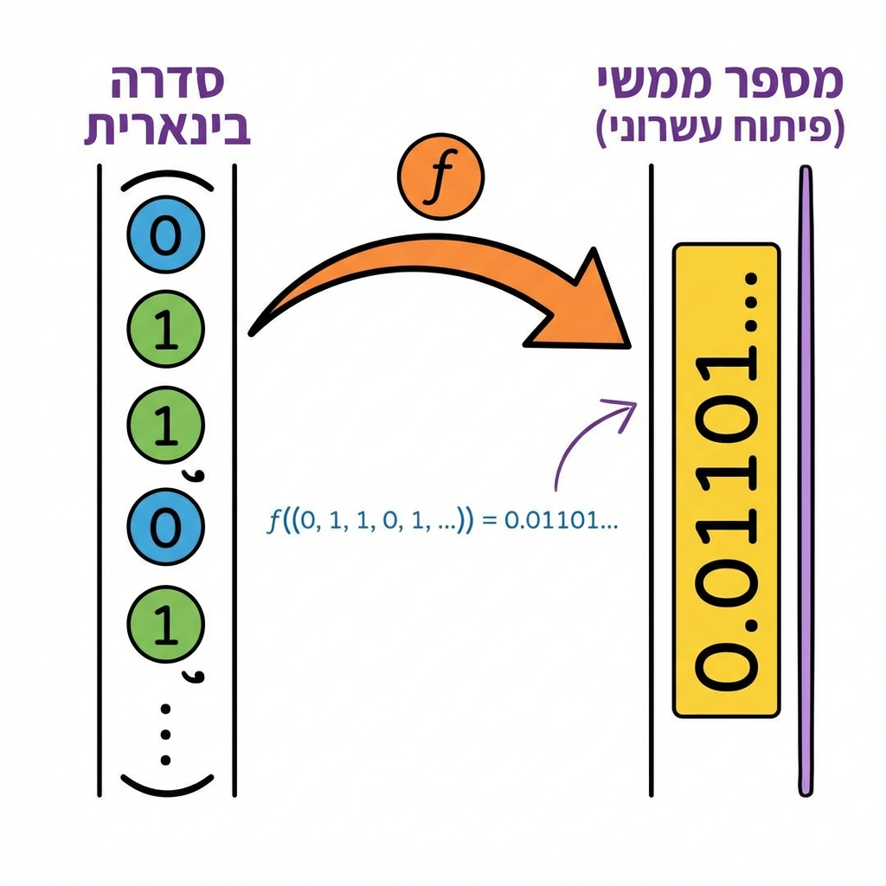

---

#  $\{0,1\}^\mathbb{N} \sim \mathbb{R}$ (המשך)

- כיוון שני: $\mathbb{R} \curlyeqprec \{0,1\}^\mathbb{N}$

  - ידוע ש-$\mathbb{R} \sim (0,1)$. לכן מספיק להראות ש-$(0,1) \curlyeqprec \{0,1\}^\mathbb{N}$.

  - לכל מספר ממש $x \in (0,1)$ יש פיתוח בינארי יחיד עם מקדמים $b_n \in \{0,1\}$ (אם נמנעים מפיתוח שמסתיים ב-1 אינסופי):
    $$x = 0.b_1b_2b_3\ldots_2 = \sum_{n=1}^{\infty} \frac{b_n}{2^n}$$

  - נגדיר $g \colon (0,1) \to \{0,1\}^\mathbb{N}$ כך שתעביר את $x$ לסדרת הספרות הבינאריות שלו:
    $g(x) = (b_1, b_2, b_3, \ldots)$

  - **הפונקציה $g$ חד-חד-ערכית:**
    - אם $x \neq y$, אז בהכרח יש להם פיתוח בינארי שונה (בהנחה שבחרנו את הייצוג הקנוני שאינו מסתיים ב-1 אינסופי).
    - לכן הסדרות שונות, כלומר $g(x) \neq g(y)$.

- סיכום:  לפי קנטור-ברנשטיין: $\mathbb{R} \sim \{0,1\}^\mathbb{N}$ ולכן $\mathbb{R} \sim \mathcal{P}(\mathbb{N})$.

---
section: תרגילים
# תרגיל לדוגמה: לכל קבוצה אינסופית קיימת תת קבוצה שעוצמתה $\aleph_0$
---

- תהי $A$ קבוצה אינסופית.

- נגדיר סדרה של איברים $a_0, a_1, a_2, \ldots$ כך:
  - $a_0 \in A$.
  - לכל $n > 0$, נגדיר את $a_n$ כאיבר כלשהו בקבוצה $A \setminus \{a_i \mid i < n\}$.
- לא ייתכן שקבוצה זו ריקה, כי אז עוצמת הקבוצה $A$ היא $n$ לכל היותר, אבל $A$ אינסופית.
- לכן האיבר $a_n$ מוגדר היטב.
- הקבוצה $\{a_n \mid n \in \mathbb{N}\}$ היא תת קבוצה של $A$, ועוצמתה $\aleph_0$.

  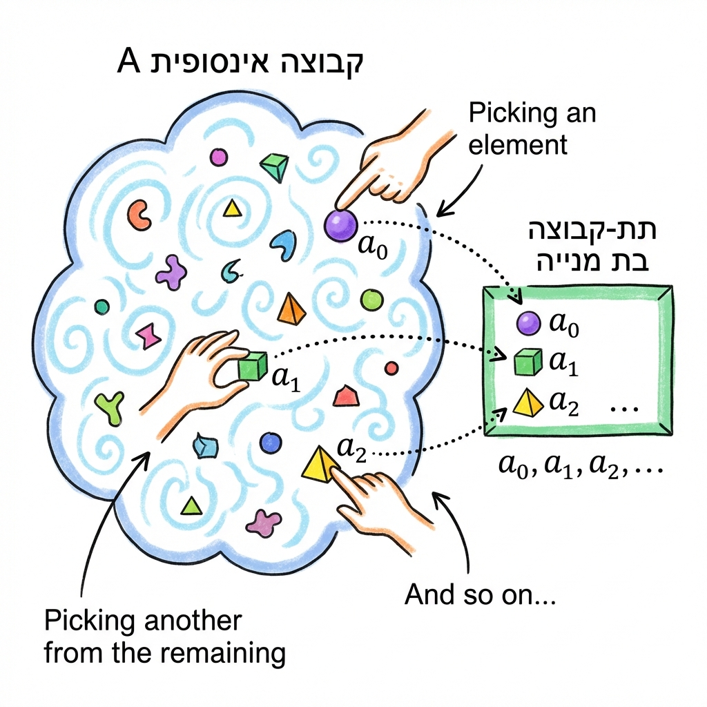

---

# תרגיל לדוגמה: $\mathbb{R} \setminus \mathbb{N} \sim \mathbb{R}$

- $\mathbb{Z} \setminus \mathbb{N} \sim \mathbb{N}$:
  - $\mathbb{Z} \setminus \mathbb{N}$ היא תת קבוצה של $\mathbb{Z}$, ולכן היא בת מניה.
  
  - בנוסף היא אינסופית.

- תהי $f\colon \mathbb{Z} \to \mathbb{Z} \setminus \mathbb{N}$ פונקציה חד-חד-ערכית ועל.

- נגדיר $g\colon \mathbb{R} \to \mathbb{R} \setminus \mathbb{N}$ על פי:
  $$g(x) = \begin{cases} 
  f(x) & x \in \mathbb{Z} \\
  x & x \in \mathbb{R} \setminus \mathbb{Z} 
  \end{cases}$$
- ניתן לראות בקלות שזו פונקציה חד-חד-ערכית ועל.

  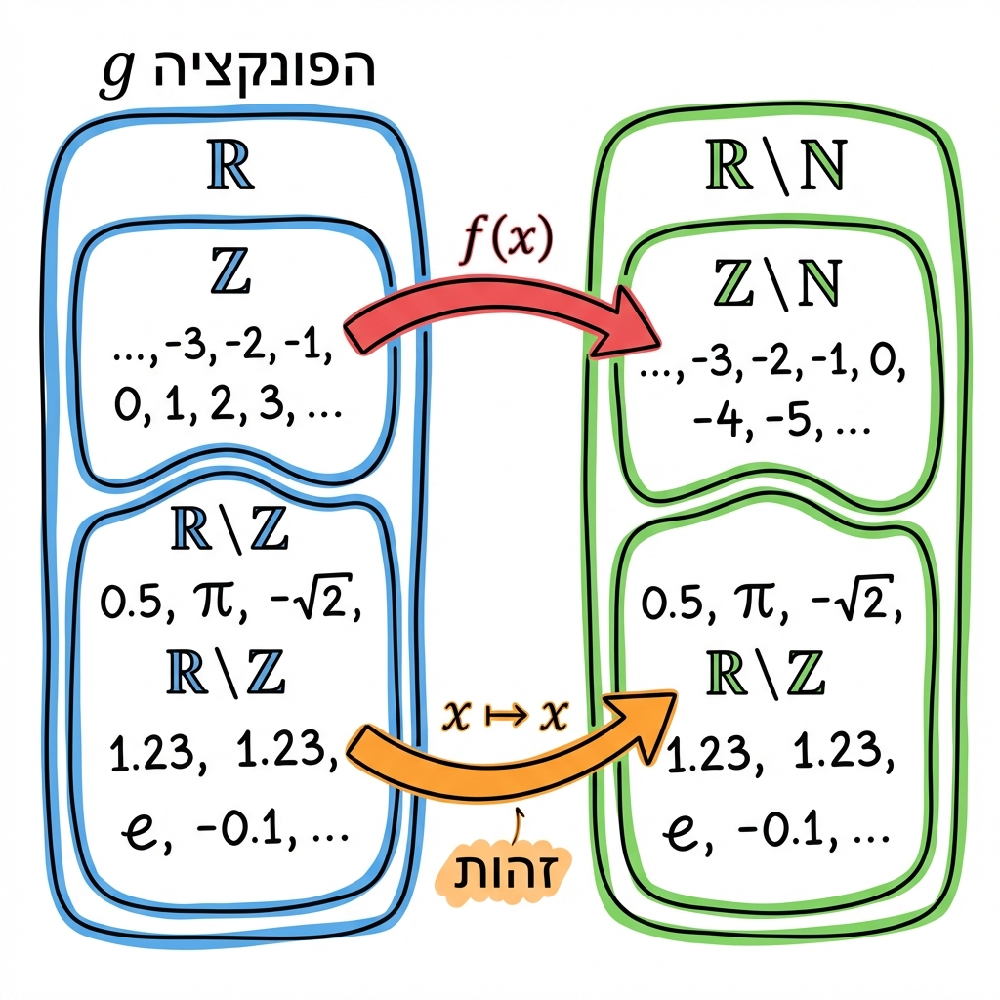

---

# תרגיל לדוגמה: $\mathcal{P}(\mathcal{P}(\mathbb{N} \times \mathbb{N})) \not\sim \mathbb{R}$

- נניח בשלילה ש-$\mathcal{P}(\mathcal{P}(\mathbb{N} \times \mathbb{N})) \sim \mathbb{R}$.

- ידוע ש-$\mathbb{R} \sim \mathcal{P}(\mathbb{N})$.
- לכן, לפי ההנחה, $\mathcal{P}(\mathcal{P}(\mathbb{N} \times \mathbb{N})) \sim \mathcal{P}(\mathbb{N})$.

- ידוע גם ש-$\mathcal{P}(\mathbb{N} \times \mathbb{N}) \sim \mathcal{P}(\mathbb{N})$.

- מכאן נובע ש-$\mathcal{P}(\mathcal{P}(\mathbb{N} \times \mathbb{N})) \sim \mathcal{P}(\mathcal{P}(\mathbb{N}))$.

- אבל $\mathcal{P}(\mathcal{P}(\mathbb{N}))$ היא קבוצה גדולה יותר מ-$\mathcal{P}(\mathbb{N})$.

- קיבלנו סתירה, ולכן $\mathcal{P}(\mathcal{P}(\mathbb{N} \times \mathbb{N})) \not\sim \mathbb{R}$.

---

# תרגיל לדוגמה: $(\{0,1\}^\mathbb{N})^\mathbb{N} \sim \mathbb{R}$

- נחשב את העוצמה של הקבוצה $(\{0,1\}^\mathbb{N})^\mathbb{N}$:
  $$|(\{0,1\}^\mathbb{N})^\mathbb{N}| = (2^{\aleph_0})^{\aleph_0}$$

- לפי חוקי חזקות של עוצמות ($(a^b)^c = a^{b \cdot c}$):
  $$(2^{\aleph_0})^{\aleph_0} = 2^{\aleph_0 \cdot \aleph_0}$$

- ידוע כי $\aleph_0 \cdot \aleph_0 = \aleph_0$.

- לכן:
  $$2^{\aleph_0 \cdot \aleph_0} = 2^{\aleph_0}$$

- וידוע כי $2^{\aleph_0} = \mathfrak{c}$ (עוצמת הרצף).

- לכן:
  $$(\{0,1\}^\mathbb{N})^\mathbb{N} \sim \mathbb{R}$$

---

# תרגיל לדוגמה: הוכחת הזהות $(A^B)^C \sim A^{B \times C}$

- נגדיר התאמה $F \colon (A^B)^C \to A^{B \times C}$.

- יהי $f \in (A^B)^C$. פונקציה זו מתאימה לכל $c \in C$ פונקציה $f(c) \in A^B$. נסמן $h_c = f(c)$. כלומר $h_c \colon B \to A$.

- נגדיר את הפונקציה $g = F(f)$ כך שלכל זוג $\langle b, c \rangle \in B \times C$:
  $g(b, c) = h_c(b) = (f(c))(b)$

- **נראה ש-$F$ על (Surjective):**
  - תהי $g \in A^{B \times C}$. נחפש $f \in (A^B)^C$ כך ש-$F(f)=g$.
  - נגדיר את $f$ כך שלכל $c \in C$, הפונקציה $f(c) \colon B \to A$ מקיימת: $(f(c))(b) = g(b, c)$.
  - לפי הגדרה זו, לכל זוג $(b,c)$ מתקיים $(F(f))(b,c) = (f(c))(b) = g(b,c)$, ולכן $F(f) = g$.

- **נראה ש-$F$ חד-חד-ערכית (Injective):**
  - נניח $F(f_1) = F(f_2) = g$.
  - לכל $c \in C$ ולכל $b \in B$, מתקיים $(f_1(c))(b) = g(b,c) = (f_2(c))(b)$.
  - לכן הפונקציות $f_1(c)$ ו-$f_2(c)$ זהות לכל $c$, כלומר $f_1 = f_2$.

