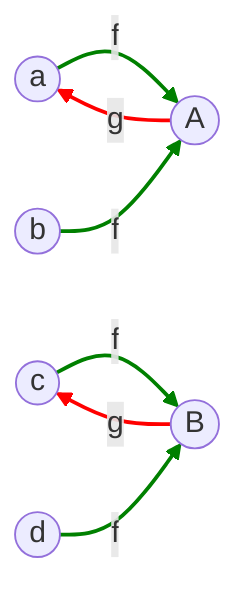
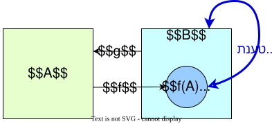
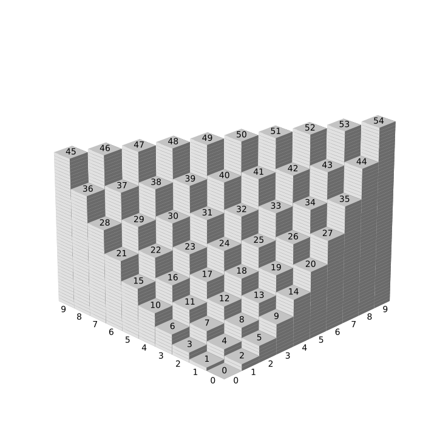
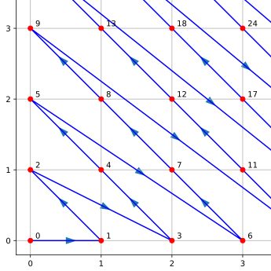

# אינדוקציה מבנית

## הרצאה בקורס: מבוא ללוגיקה ותורת הקבוצות

 מרצה: פרופ. גרא וייס

---

# עוצמות

- למדנו כיצד לקבוע את גודל הקבוצות הסופיות באמצעות פונקציות חד-חד ערכיות ועל.

- בחלק זה, נלמד שלא כל הקבוצות האינסופיות הן באותו הגודל.

  

- בשלב זה, כדאי להזכיר שוב שאנו מניחים את אקסיומת הבחירה לאורך כל החלק הזה.

- מושגים אלו קשים להבנה, ולכן נמנע מסיבוך הדיון בדיונים פורמליים על תורת הקבוצות.

- עם זאת, צריך לזכור שמושגים אלו אינם פשוטים והשפעות הבחירה על המתמטיקה הן נושא שנחקר עד היום.

---
section: סדר ושקילות עוצמה
---

# הסימונים  $\sim$ ו-$\curlyeqprec$
 
- נתחיל עם הסימונים הבאים לשתי קבוצות $A$ ו-$B$:

  - $A \sim B$: קיימת פונקציה חד-חד ערכית ועל מ-$A$ ל-$B$.

  - $A \curlyeqprec B$: קיימת פונקציה חד-חד ערכית מ-$A$ ל-$B$.

- ברור ש-$A \sim B \Rightarrow A \curlyeqprec B$.

- כפי שהסימון רומז, נרצה שאם $A \curlyeqprec B$ ו-$B \curlyeqprec A$ אז $A \sim B$.

 

  

    
    
גאורג קנטור 1845-1918

  

  

    
    
פליקס ברנשטיין 1878-1956

  

<!--
ס
-->

---

# יחס שקילות בין קבוצות

- $\sim$ הוא יחס שקילות מעל $\mathcal{P}(A)$ עבור כל קבוצה $A$.

- **רפלקסיביות**: 
  - פונקציית הזהות $id_A\colon A \to A$ היא חד-חד-ערכית ועל.

- **סימטריות**: 
  - אם $f\colon A \to B$ היא פונקציה חד-חד-ערכית ועל, אז
    $f^{-1}\colon B \to A$
    חד-חד-ערכית ועל.

- **טרזיטיביות**: 
  - נניח $f\colon A \to B$ ו-$g\colon B \to C$ הן פונקציות חד-חד ערכיות ועל.
  
  - אז $g \circ f\colon A \to C$ היא פונקציה חד-חד ערכית ועל.

  

---

# אם $A \sim B$ אז $\mathcal{P}(A) \sim \mathcal{P}(B)$.

- נניח $f \colon A \to B$ היא פונקציה חד-חד-ערכית ועל.

- נגדיר את הפונקציה 
$g \colon \mathcal{P}(A) \to \mathcal{P}(B)$
על ידי הכלל 
$g(S) = f[S]$ 
לכל $S \subseteq A$.

- $g$ היא חד-חד-ערכית:
  - נניח $g(S_1) = g(S_2)$ עבור $S_1, S_2 \subseteq A$.
  - אז $f[S_1] = f[S_2]$.
  - מכיוון ש-$f$ היא חד-חד-ערכית, נובע ש-$S_1 = S_2$:
    - יהי $i \in \{1, 2\}$.
    - אם $x \in S_i$ אז $f(x) \in f[S_i]$
    - מכיוון ש-$f[S_{(2-i)+1}] = f[S_i]$, נובע ש-$f(x) \in f[S_{(2-i)+1}]$
    - מכיוון ש-$f$ חד-חד-ערכית, נובע ש-$x \in S_{(2-i)+1}$.

- $g$ היא על:
  - תהי $T \subseteq B$.
  - נגדיר 
  $S = f^{-1}(T)$.
  - אז $g(S) = T$.

  

---

# אם קיימת פונקציה על מקבוצה $A$ לקבוצה $B$, אז $B \curlyeqprec A$

- נניח $f\colon A \to B$ היא פונקציה על.

- נגדיר את הפונקציה $g\colon B \to A$ כך:
  - עבור כל $b \in B$, נבחר $a_b \in A$ כך ש-$f(a_b) = b$ (אפשר לעשות זאת כי $f$ היא פונקציה על).

  - נגדיר $g(b) = a_b$.

- נראה ש-$g$ היא פונקציה חד-חד-ערכית:
  - נניח $g(b_1) = g(b_2)$ עבור $b_1, b_2 \in B$.

  - אז $a_{b_1} = a_{b_2}$.

  - מכיוון ש-$f(a_{b_1}) = b_1$ ו-$f(a_{b_2}) = b_2$, נובע ש-$b_1 = b_2$.

- מכאן נובע ש-$g$ היא פונקציה חד-חד-ערכית, ולכן $B \curlyeqprec A$.

  הטענה הזו היא "אם ורק אם" כל עוד $A$ לא ריקה

---

# אם $E$ יחס שקילות מעל $A$, אז $A/E \curlyeqprec A$

- נניח $E$ הוא יחס שקילות מעל $A$.

- נגדיר את הפונקציה $f \colon A \to A/E$ כך: $f(a) = [a]$ לכל $a \in A$.

- נראה ש-$f$ היא פונקציה על:

  - נניח $[a] \in A/E$.

  - אז $f(a) = [a]$ ולכן $[a] \in \text{image}(f)$.

  

---
section: משפט קנטור ברנשטיין
---

# טענת עזר: אם $X \subseteq Y$ ויש פונקציה $f\colon Y \to X$ שהיא חד-חד-ערכית. אז $X \sim Y$.

- נגדיר קבוצות $E_n$ באינדוקציה:
  $$E_0 = Y \setminus X$$
  $$E_{i+1} = f[E_i] = \{f(a) : a \in E_i\}$$
- נגדיר 
$$E = \bigcup \{ E_i \mid i \in \mathbb{N} \}$$
- נגדיר את הפונקציה $h \colon Y \to X$ כך:
  $$h(y) = \begin{cases} 
      f(y) & \text{if } y \in E \\
      y & \text{if } y \in Y \setminus E 
  \end{cases}$$

  

    
  

---

# המשך טענת העזר

- $h$ היא פונקציה חד-חד-ערכית:
   - נניח $y_1 \neq y_2 \in Y$. יש שלוש אפשרויות:
     
     1. $y_1, y_2 \in E$:  אז $h(y_1) = f(y_1)$ ו-$h(y_2) = f(y_2)$. מכיוון ש-$f$ חד-חד-ערכית, $y_1 \neq y_2$ גורר $f(y_1) \neq f(y_2)$ ולכן $h(y_1) \neq h(y_2)$.

     2. $y_1, y_2 \in Y \setminus E$: אז $h(y_1) = y_1$ ו-$h(y_2) = y_2$. לכן $y_1 \neq y_2$ גורר $h(y_1) \neq h(y_2)$.

     3. $y_1 \in E$ ו-$y_2 \in Y \setminus E$: אז $h(y_1) = f(y_1)$ ו-$h(y_2) = y_2$. מכיוון ש-$y_1 \in E$, יש $n \in \mathbb{N}$ כך ש-$y_1 \in E_n$. אז $f(y_1) \in E_{n+1}$ ו-$f(y_1) \in E$. לכן, מכיוון ש-$y_2 \notin E$, נובע ש-$f(y_1) \neq y_2$ ולכן $h(y_1) \neq h(y_2)$.

- $h$ היא פונקציה על:
   - נניח $x \in X$. אם $x \in Y \setminus E$, אז $h(x) = x$ ולכן $x \in \text{image}(h)$. אם $x \in E$, אז $x \in E_n$ עבור $n \in \mathbb{N}$. מכיוון ש-$E_0 = Y \setminus X$, $x \notin E_0$, ולכן $n > 0$. אם $x \in E_n$ עבור $n > 0$, אז לפי הגדרת $E_n$, יש $y \in E_{n-1}$ כך ש-$x = f(y)$. מכיוון ש-$y \in E_{n-1}$, $y \in E$ ולכן $h(y) = f(y) = x$ ולכן $x \in \text{image}(h)$.

מכאן נובע ש-$h$ היא פונקציה חד-חד-ערכית ועל, ולכן $X \sim Y$.

---

# משפט קנטור ברנשטיין: אם $A \curlyeqprec B$ ו-$B \curlyeqprec A$, אז $A \sim B$.

  

     
  

---

# משפט קנטור ברנשטיין: אם $A \curlyeqprec B$ ו-$B \curlyeqprec A$, אז $A \sim B$.

### הוכחה:

- נניח $A$ ו-$B$ הן קבוצות ויש פונקציות חד-חד-ערכיות $f\colon A \to B$ ו-$g\colon B \to A$.

- $f \circ g$ היא הרכבה של שתי פונקציות חד-חד-ערכיות ולכן היא חד-חד-ערכית.

- היא פונקציה מ-$B$ ל-$f[A]$

- לפי טענת העזר נובע ש-$f[A] \sim B$.

- $f$ היא פונקציה חד-חד-ערכית ועל מ-$A$ ל-$f[A]$, ולכן $A \sim f[A]$.

- מכאן נובע ש-$A \sim B$.

  

     
  

---
section: קבוצות בנות מנייה
---

# קבוצות בנות מנייה

- קבוצה $A$ נקראת בת מנייה אם $A$ סופית או $A \sim \mathbb{N}$.

- אם $A \sim \mathbb{N}$ נאמר ש-$A$ היא בת מנייה אינסופית או $|A| = \aleph_0$  ונאמר שהגודל (העוצמה) של $A$ הוא $\aleph_0$.

- דוגמאות:
  - $2\mathbb{N} = \{0, 2, 4, 6, \ldots\}$ היא קבוצה בת מנייה.
    - כדי לראות זאת, נבחן את הפונקציה $f \colon \mathbb{N} \to 2\mathbb{N}$ כאשר $f(x) = 2x$.
    - קל להוכיח שפונקציה זו היא חד-חד-ערכית ועל.

  - $\mathbb{Z}$ היא קבוצה בת מנייה:
    - נבחן את הפונקציה $f \colon \mathbb{N} \to \mathbb{Z}$
      $$f(x) = \begin{cases} 
          \frac{x+1}{2} &  \text{ אי-זוגי} \, x \, \text{אם } \\
          -\frac{x}{2} &  \text{ זוגי}\, x \,  \text{אם }
        \end{cases}$$

    - קל להוכיח שפונקציה זו היא חד-חד-ערכית ועל.
  
  

    

      
    

  

---

# $A$ בת מנייה אם ורק אם $A \curlyeqprec \mathbb{N}$

- ($\Rightarrow$) אם $A$ היא בת מנייה אז $A$ סופית או $A \sim \mathbb{N}$.
  - אם $A$ סופית, אז קיימת פונקציה חד-חד-ערכית ועל $f\colon A \to \mathbb{N}^{<n}$ עבור $n \in \mathbb{N}$. לכן קיימת פונקציה $g\colon A \to \mathbb{N}$ כאשר $g(a) = f(a)$ לכל $a \in A$, שהיא חד-חד-ערכית מ-$A$ ל-$\mathbb{N}$ ולכן $A \sim \mathbb{N}$.
  - אם $A \sim \mathbb{N}$ אז כפי שראינו קודם $A \curlyeqprec \mathbb{N}$.

- ($\Leftarrow$) אם $A \curlyeqprec \mathbb{N}$, אז קיימת פונקציה חד-חד-ערכית $f\colon A \to \mathbb{N}$. נחלק את ההוכחה לשני מקרים: 

  -  אם התמונה של $f$ חסומה. אז כפי שהוכחנו קודם, התמונה של $f$ סופית וקיים $n \in \mathbb{N}$ ופונקציה חד-חד-ערכית ועל $g\colon \text{image}(f) \to \mathbb{N}^{<n}$. לכן $g \circ f$ היא פונקציה חד-חד-ערכית ועל מ-$A$ ל-$\mathbb{N}^{<n}$ ולכן $A$ סופית. מכאן $A$ בת מנייה.
  - אם התמונה של $f$ אינה חסומה. נגדיר $B = \text{image}(f)$ ונבחן את הפונקציה $g\colon \mathbb{N} \to B$ כך:
    - $g(i) = \min(B \setminus \{g(0), \ldots, g(i-1)\})$
    - פונקציה זו מוגדרת אינדוקטיבית ולכן אם $n \in \text{dom}(g)$ אז $m \in \text{dom}(g)$ לכל $m < n$. אם תחום $g$ הוא $\mathbb{N}^{<n}$, אז זה יגרום לכך ש-$B$ חסומה ולכן תחום $g$ הוא $\mathbb{N}$ כי $B$ אינה חסומה.

---

# המשך  

 
  - נראה ש-$g$ היא פונקציה חד-חד-ערכית ועל:
    - $g$ היא חד-חד-ערכית: נשים לב ש-$g(i) < g(j)$ עבור $i < j$ כי $g(i)$ הוא המינימום של קבוצה הכוללת את $g(j)$ ו-$g(j)$ הוא מינימום של קבוצה שאינה כוללת את $g(i)$. זה בפרט אומר ש-$g$ היא חד-חד-ערכית.
    - $g$ היא על: נניח $n \in B$. אז אם $n \notin \{g(0), \ldots, g(n)\}$, אז $g(0), \ldots, g(n) < n$ כי אלו מינימום של קבוצות הכוללות את $n$. זה יגרום לכך שיש $n+1$ איברים ב-$\mathbb{N}$ הקטנים מ-$n$. סתירה. לכן $n \in \{g(0), \ldots, g(n)\}$. מכאן $g$ היא על.
  - לכן $g$ היא פונקציה חד-חד-ערכית ועל מ-$\mathbb{N}$ ל-$\text{image}(f)$ ו-$g^{-1} \circ f\colon A \to \mathbb{N}$ היא גם פונקציה חד-חד-ערכית ועל ולכן $A \sim \mathbb{N}$.

---

# אם $A$ בת מנייה ו-$A' \subseteq A$, אז $A'$ בת מנייה

  

    
  

---

# אם $A$ בת מנייה ו-$A' \subseteq A$, אז $A'$ בת מנייה

- הראינו ש-$A$ היא בת מנייה אם ורק אם $A \curlyeqprec \mathbb{N}$.

- נניח $f\colon A \to \mathbb{N}$ היא פונקציה חד-חד-ערכית המעידה על כך.

- כעת נבחן את הפונקציה המצומצמת $f\restriction_{A'}\colon A' \to \mathbb{N}$.

- פונקציה זו עדיין חד-חד-ערכית ולכן $A' \curlyeqprec \mathbb{N}$ ומכאן ש-$A'$ בת מנייה.

  

    
  

---

# איחוד סופי של קבוצות בנות מנייה הוא קבוצה בת מנייה

  

    
  

---

# איחוד סופי של קבוצות בנות מנייה הוא קבוצה בת מנייה

- נניח $A_0, A_1, \ldots, A_{n-1}$ הן קבוצות בנות מנייה.
- מכיוון שאיחוד סופי של קבוצות סופיות הוא סופי ואיחוד של קבוצה סופית וקבוצה בת מנייה הוא בת מנייה, נניח ללא הגבלת הכלליות ש-$A_0, A_1, \ldots, A_{n-1}$ הן בנות מנייה אינסופיות.

-   נתחיל במקרה המיוחד שבו $A_0, A_1, \ldots, A_{n-1}$ זרות בזוגות. 
  - נניח $A_0, A_1, \ldots, A_{n-1}$ זרות בזוגות ובנות מנייה אינסופיות.
  - אז קיימות פונקציות חד-חד-ערכיות ועל $f_i: A_i \to \mathbb{N}$.
  - נבחן את $\mathbb{N}/R$ באשר $R$ היחס $R = \{ \langle i, j \rangle \mid j \equiv m \pmod n\}$.
  - זוהי קבוצת מחלקות השקילות $[0], [1], \ldots, [n-1]$. כל אחת ממחלקות אלו היא תת-קבוצה אינסופית של $\mathbb{N}$ ולכן כולן בנות מנייה אינסופיות ו-$\mathbb{N} \sim [i]$ לכל $0 \leq i \leq n-1$.
  - נניח $g_i: \mathbb{N} \to [i]$ הן פונקציות חד-חד-ערכיות ועל המעידות על כך.
  - נבחן את הפונקציה $h: \bigcup_{i=0}^{n-1} A_i \to \mathbb{N}$ המוגדרת כ-$h(a) = g_i(f_i(a))$ אם $a \in A_i$.
  - לכל $i$, $g_i \circ f_i$ היא פונקציה חד-חד-ערכית ועל מ-$A_i$ ל-$[i]$
  - מכיוון שהתחומים והתמונות זרות בזוגות ואיחוד התמונות הוא 
    $\mathbb{N}$,  
    $h$ היא פונקציה חד-חד-ערכית ועל.

  

    
  

---

# המשך

- כעת נבחן את המקרה שבו $A_i$ אינן בהכרח זרות בזוגות.
  - נגדיר $B_0, B_1, \ldots, B_{n-1}$ כך:
    - $B_0 = A_0$
    - $B_i = A_i \setminus \bigcup_{j=0}^{i-1} B_j$
  - נראה ש-$\bigcup_{i=0}^{n-1} A_i = \bigcup_{i=0}^{n-1} B_i$:
    - אם $a \in \bigcup_{i=0}^{n-1} A_i$, אז $a \in A_m$ עבור $m$ כלשהו ולכן $a \in B_m$ או $a \in B_k$ עבור $k < m$. לכן $a \in \bigcup_{i=0}^{n-1} B_i$ ומכאן $\bigcup_{i=0}^{n-1} A_i \subseteq \bigcup_{i=0}^{n-1} B_i$.
    - מכיוון ש-$B_i \subseteq A_i$, נובע ש-$\bigcup_{i=0}^{n-1} B_i \subseteq \bigcup_{i=0}^{n-1} A_i$ ולכן $\bigcup_{i=0}^{n-1} A_i = \bigcup_{i=0}^{n-1} B_i$.
  - נראה ש-$B_i \cap B_j = \emptyset$ עבור $i \neq j$:
    - אם $i \neq j$, נניח ללא הגבלת הכלליות ש-$i > j$. אז $a \in B_i$ גורר $a \notin B_j$.
  <!-- - אם חלק מה-$B_i$ סופיות, נגדיר $C = \bigcup \{b \in B_i \mid B_i סופית ו-0 \leq i \leq n-1\}$. מכיוון ש-$C$ הוא איחוד סופי של קבוצות סופיות, $C$ סופית.
  - נגדיר $D = \bigcup \{b \in B_i \mid B_i אינסופית ו-0 \leq i \leq n-1\}$. אז $D$ הוא איחוד סופי של קבוצות בנות מנייה אינסופיות ולכן הוא בת מנייה.
  - $\bigcup_{i=0}^{n-1} B_i = C \cup D$ ומכיוון שאיחוד של קבוצה בת מנייה וקבוצה סופית הוא בת מנייה, $\bigcup_{i=0}^{n-1} B_i$ בת מנייה ולכן $\bigcup_{i=0}^{n-1} A_i$ בת מנייה. -->

---
section: דוגמאות
---

# $\mathbb{N} \times \mathbb{N}$ היא קבוצה בת מנייה

  

- נגדיר את הפונקציה $f\colon \mathbb{N} \times \mathbb{N} \to \mathbb{N}$ כך:
  $$f(x, y) = \frac{(x+y)(x+y+1)}{2} + y$$

- זאת פונקציה חד-חד ערכית ועל:

---

# הגדרת זוגות באופן רקורסיבי

נתחיל עם:
 $$C(0) = (0, 0)$$

ו-
$$C(i+1) = \begin{cases} 
    \langle y+1, 0  \rangle &  C(i)=\langle 0,y \rangle \\
    \langle x-1, y-1\rangle &  C(i)=\langle x,y \rangle, x\neq 0
  \end{cases}$$

 

1. פונקציית הזיווג ממפה באופן שיטתי את הזוגות $\langle x, y\rangle$ על ידי מעבר על האלכסונים של $\mathbb{N} \times \mathbb{N}$.
2. בתוך כל אלכסון, הזוגות מזוהים באופן ייחודי מכיוון ש:
    - כל אלכסון $d$ מתאים לכל הזוגות $\langle x, y\rangle$ כך ש-$x + y = d$.
    - הזוגות על האלכסון $d$ ממופים בסדר קבוע שמתחיל מ-$\langle d, 0\rangle$ ונע שמאלה לאורך $\langle d-1, 1 \rangle, \langle d-2, 2\rangle, \dots, \langle 0, d  \rangle$.
3. מכיוון שהמיפוי מתחיל מ-$\langle 0, 0 \rangle$ ועובר באופן שיטתי על כל האלכסונים, אף זוג לא חוזר על עצמו.
4. לכן זאת פונקציה חד-חד ערכית ועל.

  

    
  

---

# מסקנה: $\mathbb{Q}$ היא קבוצה בת מנייה

$$\mathbb{Q} = (\mathbb{N} \times \mathbb{N}) / R$$

באשר

$$R = \{ \langle \langle a_1, b_1 \rangle, \langle a_2, b_2 \rangle \rangle \mid a_1 \cdot b_2 = a_2 \cdot b_1 \}$$

הוכחנו שמרחב המנה קטן עוצמה מהמרחב עצמו לכל יחס ולכן

$$\mathbb{Q} \curlyeqprec \mathbb{N} \times \mathbb{N} \sim \mathbb{N}$$

הוכחנו גם שכל קבוצה שהיא קטנת עוצמה מקבוצה בת-מנייה היא בת מנייה 
 לכן
$\mathbb{Q}$ היא בת מנייה.

---
section: אריתמטיקה של עוצמות
---

# איחוד בן מנייה של קבוצות בנות מנייה הוא בן מנייה

- נניח שיש לנו קבוצה בת מנייה של קבוצות בנות מנייה: $A = \{A_n \mid n \in \mathbb{N}\}$

- נבנה פונקציה $h \colon \mathbb{N} \times \mathbb{N} \to \bigcup_{n \in \mathbb{N}} A_n$ שהיא על.
- כל $A_i$ היא קבוצה בת מנייה, ולכן נבחר פונקציה $g_i \colon \mathbb{N} \to A_i$ שהיא על. (היכולת שלנו לבחור פונקציות אלו נובעת מאקסיומת הבחירה).

- כעת נגדיר את $h$ כך:  $h(\langle a, b \rangle) = g_a(b)$

- $h$ היא על:
  - יהי $a \in \bigcup_{n \in \mathbb{N}} A_n$.
  - אזי $a \in A_i$ עבור איזה שהוא $i \in \mathbb{N}$.
  - לכן, $a \in \text{image}(g_i)$ ולכן קיים $m \in \mathbb{N}$ כך ש-$a = g_i(m)$.
  - מכאן ש-$h(\langle i, m \rangle) = a$.

- מכיוון ש-$h$ היא על, האיחוד $\bigcup_{n \in \mathbb{N}} A_n$ הוא בן מנייה.

---

# מכפלה קרטזית של $n$   קבוצות

- יהיו $A_1, \ldots, A_n$ קבוצות.
  נרחיב את הגדרת המכפלה הקרטזית של $n$ קבוצות:
  $$A_1 \times \cdots \times A_n = \{ \langle a_1, \ldots, a_n \rangle \mid a_1 \in A_1, \ldots, a_n \in A_n\}$$

- האלמנטים של קבוצות אלו נקראים $n$-יות סדורות. אניה סדורה בת 2 אברים היא פשוט זוג סדור.
  
- המכפלה הקרטזית של הקבוצה הריקה עם כל קבוצה אחרת היא כמובן ריקה.
  
- **המכפלה הקרטזית של $n$ קבוצות היא בת מנייה**:
   - בסיס האינדוקציה: מכפלה של שתי קבוצות בנות מנייה היא בת מנייה.
   
   - צעד אינדוקציה:   נניח שהמכפלה $A_1 \times A_2 \times \dots \times A_k$ היא בת מנייה.
     - נוסיף קבוצה נוספת $A_{k+1}$ ונקבל ש
      $
      (A_1 \times A_2 \times \dots \times A_k) \times A_{k+1}
      $
      היא בת מנייה לפי המקרה של שתי קבוצות.

     -  קל לראות שהפונקציה $f\colon A_1 \times A_2 \times \dots \times A_k \times A_{k+1} \to (A_1 \times A_2 \times \dots \times A_k) \times A_{k+1}$ המקיימת 
     $f(\langle a_1, \ldots, a_k, a_{k+1} \rangle) = \langle \langle a_1, \ldots, a_k \rangle, a_{k+1} \rangle$
     היא חד-חד-ערכית ועל.

---

# $\text{FinSeq}(\mathbb{N})$ היא קבוצה בת מנייה

  $$\text{FinSeq}(\mathbb{N}) = \bigcup_{m \in \mathbb{N}} \{ \langle a_1, \ldots, a_m \rangle  \mid a_i \in \mathbb{N}\}$$
- היא איחוד בן מנייה של קבוצות בנות מנייה ולכן היא בת מנייה.

- אפשר לחשוב על $\text{FinSeq}(\mathbb{N})$ כעל קבוצת כל הרצפים הסופיים של מספרים טבעיים.

- גם כל הפונקציות מ-
  $$\bigcup \{  \mathbb{N}^{\mathbb{N}^{<n}} \mid n \in \mathbb{N} \}$$

- איך נתאים בין שתי הקבוצות באופן חד-חד ערכי ועל?

---

# $\text{Fin}(\mathbb{N})$ היא קבוצה בת מנייה

**הגדרנו**:  
   $$
   \text{Fin}_0(\mathbb{N}) = \{\emptyset\}.
   $$

   $$
   \text{Fin}_{m+1}(\mathbb{N}) = \{A \cup \{x\} \mid A \in \text{Fin}_m(\mathbb{N}), x \in \mathbb{N} \setminus A\}.
   $$

 

- בסיס האינדוקציה:  $\text{Fin}_0(\mathbb{N}) = \{\emptyset\}$ מכילה איבר אחד בלבד ולכן בת מנייה.

 

-   שלב האינדוקציה :
  בהינתן ש-$\text{Fin}_m(\mathbb{N})$ בת מנייה, נראה ש-$\text{Fin}_{m+1}(\mathbb{N})$ בת מנייה:
    - כל קבוצה ב-$\text{Fin}_{m+1}(\mathbb{N})$ נוצרת ע"י הוספת איבר $x \in \mathbb{N}$ לקבוצה $A \in \text{Fin}_m(\mathbb{N})$.
    - $\text{Fin}_m(\mathbb{N})$ בת מנייה וקבוצת האיברים האפשריים $\mathbb{N} \setminus A$ בת מנייה.
    - מכפלה סופית של קבוצות בנות מנייה היא קבוצה בת מנייה.

 

-   האיחוד הכולל:
  $\text{Fin}(\mathbb{N}) = \bigcup_{m \in \mathbb{N}} \text{Fin}_m(\mathbb{N})$ היא איחוד בן מנייה של קבוצות בנות מנייה, ולכן בת מנייה.

---
section: משפט קנטור
---
# $\mathbb{\{0,1\}^N}$ אינה קבוצה בת מנייה

- נניח בשלילה ש-$\mathbb{\{0,1\}^N}$ היא קבוצה בת מנייה.

- אזי קיימת פונקציה חד-חד-ערכית ועל $f \colon \mathbb{N} \to \mathbb{\{0,1\}^N}$.

- נגדיר פונקציה $g \colon \mathbb{N} \to \{0,1\}$ כך ש-
    
    $g(n) = 1 - f(n)(n)$
  

- מכיוון ש-$f$ היא על, קיים $m \in \mathbb{N}$ כך ש-$f(m) = g$.

- מקבלים: $g(m) = 1 - f(m)(m) = 1 - g(m)$
- קיבלנו סתירה, ולכן ההנחה ש-$\{0,1\}^\mathbb{N}$ היא קבוצה בת מנייה אינה נכונה.

- מכאן ש-$\mathbb{\{0,1\}^N}$ אינה קבוצה בת מנייה.

  

    
  

  

    

      
    

  

  

---

# הוכחה שגויה ש-$\mathbb{R}$ אינה קבוצה בת מנייה

- אם $\mathbb{R}$ היתה קבוצה בת מנייה, אזי $[0,1]$ היתה קבוצה בת מנייה.

- נכתוב כל שבר ממשי בטווח $[0,1]$ בצורה של רצף אינסופי של ספרות בבסיס 2 אחרי הנקודה העשרונית. 
  - לדוגמה, $1/2 = 0.1\overline{0}$, $1/3 = 0.\overline{01}$, $3/4 = 0.11\overline{0}$.

- נבנה מספר $r$ באמצעות שיטת האלכסון של קנטור:

  - נניח ש-$f(n) = r_n$ כאשר $r_n$ הוא הייצוג בבסיס 2 של המספר הממשי.

  - נגדיר את הספרה ה-$n$-ית של $r$ להיות שונה מהספרה ה-$n$-ית אחרי הנקודה העשרונית של $r_n$.

- מכיוון ש-$r$ שונה מכל $r_n$  בספרה ה-$n$-ית, $r$ אינו נמצא בתמונה של $f$.

- קיבלנו סתירה, ולכן ההנחה ש-$\mathbb{R}$ היא קבוצה בת מנייה אינה נכונה.

 

  מה לא נכון בהוכחה הזאת?

---

# $\mathbb{R}$ אינה קבוצה בת מנייה

- נניח בשלילה ש-$\mathbb{R}$ היא קבוצה בת מנייה.

- אזי קבוצת השברים שניתן לכתוב באמצעות הספרות 0 ו-1 בשיטה העשרונית היא בת מנייה:

$$\left\{ \sum_{i=1}^{\infty} d_i 10^{-i} \colon \forall i \in \mathbb{N}( d_i \in \{0,1\}) \right\} \sim \mathbb{N}$$

- כל שבר כזה מיוצג באופן יחיד על ידי רצף אינסופי של ספרות 0 ו-1.

- לכן קיימת פונקציה חד-חד ערכית ועל ממנה לקבוצה $\{0,1\}^\mathbb{N}$:

$$f(\sum_{i=1}^{\infty} d_i 10^{-i})(i) = d_i$$

- בסתירה לכך ש-$\{0,1\}^\mathbb{N}$ אינה בת מנייה.

---

# משפט קנטור: $\mathcal{P}(A) \not\sim  A$

- נניח בשלילה ש-$\mathcal{P}(A) \sim  A$

- אזי קיימת פונקציה חד-חד-ערכית ועל $f \colon A \to \mathcal{P}(A)$.

- נבנה קבוצה $B \subseteq A$ כך ש-$B = \{a \in A \mid a \notin f(a)\}$.

- מכיוון ש-$f$ היא על, קיים $b \in A$ כך ש-$f(b) = B$.

- נבחן האם $b \in B$:

  - אם $b \in B$, אז לפי הגדרת $B$, $b \notin f(b)$, כלומר $b \notin B$.

  - אם $b \notin B$, אז לפי הגדרת $B$, $b \in f(b)$, כלומר $b \in B$.

- קיבלנו סתירה, ולכן ההנחה ש-$\mathcal{P}(A) \sim  A$ אינה נכונה.

  

<!-- --- 

# השערת הרצף

### השערת הרצף:
- השערת הרצף היא השערה בתורת הקבוצות שהוצעה על ידי גאורג קנטור.
- ההשערה טוענת שאין קבוצה בעלת עוצמה בין העוצמה של המספרים הטבעיים ($\aleph_0$) לבין העוצמה של המספרים הממשיים ($2^{\aleph_0}$).

### נוסח ההשערה:
- אין קבוצה $A$ כך ש-$\aleph_0 < |A| < 2^{\aleph_0}$.

### תוצאות:
- השערת הרצף היא בלתי תלויה באקסיומות של תורת הקבוצות (ZF). כלומר, לא ניתן להוכיח או להפריך אותה מתוך האקסיומות של ZF.
- השערת הרצף הוכחה כבלתי תלויה על ידי קורט גדל ופול כהן.

  

 -->

--- 

# אם קיימת $F\colon A \to A$ חד-חד-ערכית ולא על, אז $\mathbb{N} \curlyeqprec A$

- נגדיר:
  - $g(0)$ הוא איבר כלשהו ב-$A$ שאינו בתמונה של $F$ (קיים כזה כי $F$ אינה על).

  - $g_{i+1} = F(g(i))$ לכל $i \in \mathbb{N} \setminus \{0\}$.

- נראה ש-$g$ היא פונקציה חד-חד-ערכית באינדוקציה:
  - בסיס האינדוקציה: $g(0)$ קיים ואינו בתמונת $F$ ולכן גם לא בשאר התמונה של $g$.
  - צעד האינדוקציה:
    - נניח ש-$g(i) \neq g(j)$ לכל $j < i \leq n$.
    - נניח בשלילה ש- $g(i) = g(j)$ עבור  $0 < i,j \leq n+1$
    - אזי $F(g(i-1)) = g(i) = g(j) = F(g(j-1))$
    - בגלל ש-$F$ חד-חד-ערכית, $g(i-1) = g(j-1)$
    - בסתירה להנחת השלילה
  
- מכאן נובע ש-$g$ היא פונקציה חד-חד-ערכית, ולכן $\mathbb{N} \curlyeqprec A$.

---

# לכל קבוצה אינסופית קיימת תת קבוצה שעוצמתה $\aleph_0$

### הוכחה:
- תהי $A$ קבוצה אינסופית.
- נגדיר סדרה של איברים $a_0, a_1, a_2, \ldots$ כך:
  - $a_0 \in A$.
  - לכל $n > 0$, נגדיר את $a_n$ כאיבר כלשהו בקבוצה $A \setminus \{a_i \mid i < n\}$.
- לא ייתכן שקבוצה זו ריקה, כי אז עוצמת הקבוצה $A$ היא $n$ לכל היותר, אבל $A$ אינסופית.
- לכן האיבר $a_n$ מוגדר.
- הקבוצה $\{a_n \mid n \in \mathbb{N}\}$ היא תת קבוצה של $A$, ועוצמתה $\aleph_0$.

---

# $\mathbb{R} \setminus \mathbb{N} \sim \mathbb{R}$

### הוכחה:
- $\mathbb{Z} \setminus \mathbb{N} \sim \mathbb{N}$ ($\mathbb{Z} \setminus \mathbb{N}$ היא תת קבוצה של $\mathbb{Z}$, ולכן היא בת מניה, ובנוסף היא אינסופית).
- תהי $f\colon \mathbb{Z} \to \mathbb{Z} \setminus \mathbb{N}$ פונקציה חד-חד-ערכית ועל.
- נגדיר $g\colon \mathbb{R} \to \mathbb{R} \setminus \mathbb{N}$ על פי:
  $$g(x) = \begin{cases} 
  f(x) & x \in \mathbb{Z} \\
  x & x \in \mathbb{R} \setminus \mathbb{Z} 
  \end{cases}$$
- ניתן לראות בקלות שזו פונקציה חד-חד-ערכית ועל.

---

# $\mathcal{P}(2^{\mathbb{N} \times \mathbb{N}}) \not\sim \mathbb{R}$

- נניח בשלילה ש-$\mathcal{P}(2^{\mathbb{N} \times \mathbb{N}}) \sim \mathbb{R}$.

- ידוע ש-$\mathbb{R} \sim 2^{\mathbb{N}}$.
- לכן, לפי ההנחה, $\mathcal{P}(2^{\mathbb{N} \times \mathbb{N}}) \sim 2^{\mathbb{N}}$.

- ידוע גם ש-$2^{\mathbb{N} \times \mathbb{N}} \sim 2^{\mathbb{N}}$.

- מכאן נובע ש-$\mathcal{P}(2^{\mathbb{N} \times \mathbb{N}}) \sim \mathcal{P}(2^{\mathbb{N}})$.

- אבל $\mathcal{P}(2^{\mathbb{N}})$ היא קבוצה גדולה יותר מ-$2^{\mathbb{N}}$.

- קיבלנו סתירה, ולכן $\mathcal{P}(2^{\mathbb{N} \times \mathbb{N}}) \not\sim \mathbb{R}$.
